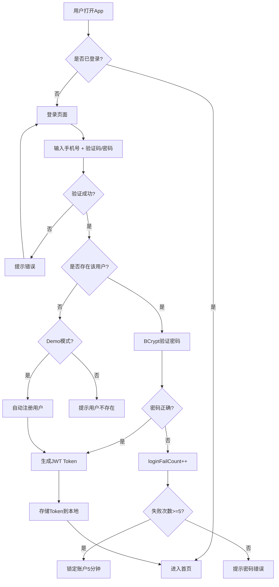
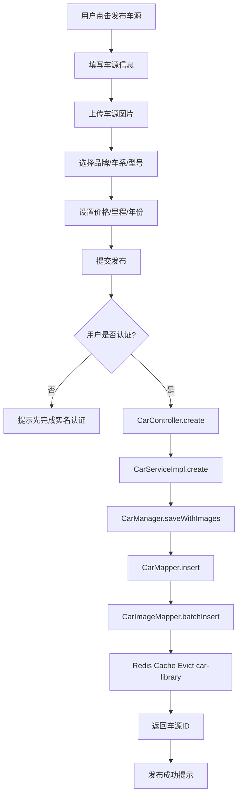
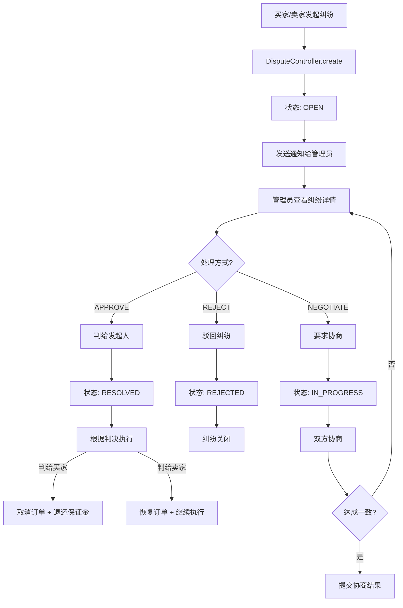
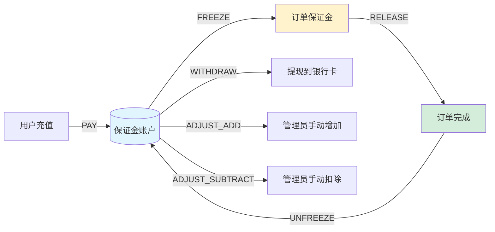

# 5D好车 B2B二手车交易平台 - 完整项目文档

**版本**: v4.0  
**最后更新**: 2026-06-14  
**维护团队**: 5D Auto Platform Team

---

## 目录

1. [项目概述](#1-项目概述)
2. [技术栈](#2-技术栈)
3. [项目结构](#3-项目结构)
4. [移动端业务架构](#4-移动端业务架构)
5. [运营端业务架构](#5-运营端业务架构)
6. [核心业务流程](#6-核心业务流程)
7. [数据模型](#7-数据模型)
8. [API设计规范](#8-api设计规范)
9. [部署架构](#9-部署架构)
10. [开发规范](#10-开发规范)
11. [测试策略](#11-测试策略)
12. [运维监控](#12-运维监控)
13. [常见问题排查](#13-常见问题排查)

---

## 1. 项目概述

### 1.1 系统定位

5D好车是一个面向B2B市场的二手车交易平台，连接个人卖家、车行买家和平台运营方，提供从车源发布、交易撮合、合同签署到资金结算的全流程服务。

### 1.2 核心角色

| 角色 | 说明 | 主要功能 |
|------|------|----------|
| **个人用户 (PERSONAL)** | C端车主/买家 | 发布车源、浏览求购、参与竞拍、查看订单 |
| **车行用户 (SHOP)** | B端经销商 | 批量采购、保证金管理、资质认证、交易统计 |
| **系统管理员 (ADMIN)** | 平台运营人员 | 审核管理、纠纷处理、数据统计、系统配置 |
| **开发人员 (DEVELOPER)** | 技术支持 | API调试、系统监控、日志查询 |

### 1.3 业务特点

- **双端协同**: 移动端(uni-app) + 运营端(Vue 3 Admin)
- **实时交互**: WebSocket推送 + Redis Pub/Sub事件总线
- **安全交易**: 保证金机制 + 智能合约 + 纠纷仲裁
- **AI赋能**: AI助理匹配 + 智能定价 + 风险预警

### 1.4 功能模块总览

#### 移动端核心模块 (13个)

| 模块ID | 模块名称 | 功能描述 | 优先级 |
|--------|----------|----------|--------|
| M01 | 找车模块 | 车源搜索、筛选、推荐、详情展示 | P0 |
| M02 | 交易模块 | 卖车/买车管理、订单流转、支付 | P0 |
| M03 | 车源发布 | 车辆信息录入、图片上传、定价 | P0 |
| M04 | 用户中心 | 个人信息、认证、信用体系 | P0 |
| M05 | 消息系统 | 站内消息、交易通知、系统公告 | P1 |
| M06 | AI助理 | AI行情分析、智能推荐、获客文案 | P1 |
| M07 | 金融服务 | 保证金管理、信用额度、贷款 | P2 |
| M08 | 出口业务 | 出口车源标记、报关支持 | P2 |
| M09 | 车行管理 | 车行信息、员工管理、权限控制 | P1 |
| M10 | 电子合同 | 合同生成、签署、模板管理 | P1 |
| M11 | 在线客服 | 实时客服聊天、工单系统 | P2 |
| M12 | 关注系统 | 关注/取关卖家、关注列表 | P2 |
| M13 | 会员体系 | 会员等级、权益、续费 | P2 |

#### 运营端核心模块 (11个)

| 序号 | 模块名称 | 待处理徽标 | 说明 |
|------|---------|-----------|------|
| 1 | 分析仪表盘 | 无 | 数据概览与核心指标展示 |
| 2 | 用户管理 | 无 | 平台用户账号管理 |
| 3 | 车行管理 | 无 | 车行信息及状态管理 |
| 4 | 车行注册审核 | **3** | 新车行入驻审核（待审核3条） |
| 5 | 5D 车源管理 | 无 | 平台车源信息管理 |
| 6 | 求购管理 | 无 | 买家求购需求管理 |
| 7 | 交易管理 | **1** | 交易订单管理（待处理1条） |
| 8 | 保证金现金流 | 无 | 保证金及资金流水管理 |
| 9 | 出口配置 | 无 | 数据导出配置 |
| 10 | 车型库 | 无 | 车型字典数据管理 |
| 11 | 资源管理 | 无 | 运营资源位及协议文本管理 |

---

## 2. 技术栈

### 2.1 移动端 (car-trade-backend + car-trade-frontend)

#### 后端技术

| 分类 | 技术组件 | 版本 | 在项目中的作用 |
|------|----------|------|----------------|
| **核心框架** | Spring Boot | 3.5.14 | 应用基础框架，提供自动配置与 Starters 体系 |
| **JDK** | Java | 21 | 项目源码级别，`--release 21` 编译，使用虚拟线程与新 API |
| **Web 层** | Spring Boot Starter Web | 3.5.14 | RESTful API / 控制器层 / 内置 Tomcat 容器 |
| **ORM** | MyBatis-Plus Spring Boot3 Starter | 3.5.6 | 数据访问层，32 个实体 + 28+ 个 Mapper，提供分页、Lambda 查询、自动填充 |
| **数据库** | PostgreSQL JDBC Driver | (由 Spring Boot BOM 管理) | 主业务数据库驱动，33张表 |
| **缓存** | Spring Boot Starter Data Redis | 3.5.14 | 车源列表缓存、热点数据、分布式会话/Token 黑名单 |
| **参数校验** | Spring Boot Starter Validation | 3.5.14 | DTO/请求参数的 `@Valid` 校验 |
| **AOP** | Spring Boot Starter AOP | 3.5.14 | `OperationLogAspect` 操作日志切面、权限切面 |
| **实时通信** | Spring Boot Starter WebSocket | 3.5.14 | 聊天/客服消息实时推送，STOMP 协议 |
| **消息队列** | RocketMQ Spring Boot Starter | 2.3.2 | `MessageProducer` / `MessageConsumer`，事件驱动、消息解耦（拍卖结算、订单状态变更） |
| **认证** | JJWT (io.jsonwebtoken) | 0.12.5 | `JwtUtil` 签发/校验 Token，`AuthenticationInterceptor` 拦截校验 |
| **代码生成** | Lombok | 1.18.36 | `@Data` / `@NoArgsConstructor` / `@AllArgsConstructor` 简化实体与 VO |
| **工具库** | Hutool All | 5.8.26 | 日期、字符串、集合、加密、HTTP 等通用工具方法 |
| **日志** | 阿里云 SLS Logback Appender | 0.1.19 | 生产环境日志投递到阿里云 SLS（Simple Log Service） |
| **序列化** | Protobuf Java | 3.25.3 | 日志/消息的二进制序列化（SLS Appender 依赖） |
| **测试** | Spring Boot Starter Test | 3.5.14 | 单元测试/集成测试（JUnit + Mockito + Spring Test） |
| **构建** | Maven Compiler Plugin | 3.11.0 | Java 21 源码编译；`spring-boot-maven-plugin` 打包可执行 JAR |

#### 前端技术

| 分类 | 技术组件 | 版本 | 在项目中的作用 |
|------|----------|------|----------------|
| **跨端框架** | uni-app | 3.0.0-alpha | 一套代码编译到 H5 / 微信小程序 / App |
| **核心视图层** | Vue | 3.4.21 | 响应式 UI 组件化开发（Composition API） |
| **状态管理** | Vuex | 4.1.0 | 全局状态（登录用户、购物车/订单状态） |
| **UI 组件库** | uView Plus | ^3.8.49 | Vue 3 时代的 uni-app UI 组件库（表单、列表、弹窗等） |
| **UI 组件库** | uView UI | ^2.0.36 | 兼容低版本组件（部分页面使用） |
| **构建工具** | Vite | ^5.0.0 | 开发服务器与 H5 构建（`npm run dev:h5` / `build:h5`） |
| **CSS 预处理器** | Sass | ^1.77.0 | `uni.scss` 全局样式变量与嵌套 CSS |
| **DCloud 插件** | @dcloudio/vite-plugin-uni | 3.0.0-alpha | Vite 下 uni-app 编译插件 |

### 2.2 运营端 (car-trade-admin-backend + car-trade-admin-frontend)

#### 后端技术

| 分类 | 技术组件 | 版本 | 在项目中的作用 |
|------|----------|------|----------------|
| **核心框架** | Spring Boot | 3.5.14 | 应用基础框架 |
| **JDK** | Java | 21 | 项目源码级别 |
| **ORM** | MyBatis-Plus | 3.5.6 | 数据访问层 |
| **数据库** | PostgreSQL | 16 (共享) | 主业务数据库 |
| **缓存** | Redis | 7 (共享) | 缓存/事件总线 |
| **认证** | JWT | 0.12.5 | 独立Token体系 |

#### 前端技术

| 分类 | 技术组件 | 版本 | 在项目中的作用 |
|------|----------|------|----------------|
| **框架** | React | 18 | 组件化UI开发 |
| **构建工具** | Vite | 5 | 开发服务器与构建 |
| **路由** | React Router | 6 | 前端路由管理 |
| **状态管理** | Zustand | 最新 | 轻量级状态管理 |
| **HTTP客户端** | Axios | 最新 | HTTP请求封装 |
| **UI样式** | TailwindCSS | 4 | 原子化CSS框架 |
| **图标** | Lucide React | 最新 | SVG图标库 |

### 2.3 数据库与缓存

| 组件 | 版本/类型 | 在项目中的作用 |
|------|-----------|----------------|
| **PostgreSQL** | 16 | 主数据库：users、car_sources、orders、contracts、auctions、chat_messages、coupons 等 33 张表 |
| **Redis** | 7.x | 1) 车源列表缓存与 TTL；2) Token/短信验证码存储；3) 热点数据（如品牌/车系列表）；4) Pub/Sub 事件总线 |

### 2.4 消息与实时通信

| 组件 | 版本/协议 | 在项目中的作用 |
|------|-----------|----------------|
| **Apache RocketMQ** | 5.x (Client 2.3.2) | `MessageProducer` 发布事件（订单创建、拍卖结算、消息通知）；`MessageConsumer` 异步消费并触发业务逻辑 |
| **WebSocket (STOMP)** | Spring WebSocket | 买家/卖家实时聊天、推送订单状态变更、拍卖出价广播；`WebSocketConfig` + `WebSocketAuthInterceptor` 实现认证握手 |

### 2.5 安全与认证

| 组件 | 版本 | 在项目中的作用 |
|------|------|----------------|
| **JWT (JJWT)** | 0.12.5 | 登录后签发 Token（含用户 ID、手机号、过期时间）；`JwtUtil` 解析与刷新；`AuthenticationInterceptor` 对 Level 2 / Level 3 接口鉴权 |
| **三级权限** | - | 1) 公开接口；2) 需登录接口；3) 商家认证接口 |

### 2.6 运维与监控

| 组件 | 版本 | 在项目中的作用 |
|------|------|----------------|
| **阿里云 SLS** | - | 集中式日志收集（Logback Appender 0.1.19 + Protobuf 3.25.3） |
| **AOP 操作日志** | - | `@OperationLog` 注解 + `OperationLogAspect`，自动记录关键业务操作 |

---

## 3. 项目结构

### 3.1 完整目录树

```
new-car-trade/
├── car-trade-backend/                    # 移动端后端
│   ├── src/main/java/com/pancosky/newcartrade/
│   │   ├── config/                       # 配置类
│   │   │   ├── WebMvcConfig.java         # MVC配置 + Auth拦截器
│   │   │   ├── RedisConfig.java          # Redis配置
│   │   │   ├── RocketMQConfig.java       # RocketMQ配置
│   │   │   └── WebSocketConfig.java      # WebSocket配置
│   │   ├── controller/                   # REST控制器
│   │   │   ├── CarController.java        # 车源管理
│   │   │   ├── OrderController.java      # 订单管理
│   │   │   ├── UserController.java       # 用户管理
│   │   │   ├── PurchaseController.java   # 求购管理
│   │   │   ├── ChatController.java       # 聊天管理
│   │   │   └── AIController.java         # AI助理
│   │   ├── service/                      # 业务逻辑层
│   │   │   ├── ICarService.java          # 车源服务接口
│   │   │   ├── IOrderService.java        # 订单服务接口
│   │   │   └── IUserService.java         # 用户服务接口
│   │   ├── manager/                      # 管理器层
│   │   │   ├── CarManager.java           # 车源管理器
│   │   │   ├── PushManager.java          # 推送管理器
│   │   │   └── TokenBlacklistService.java # Token黑名单
│   │   ├── mapper/                       # 数据访问层
│   │   │   ├── CarMapper.java            # 车源Mapper
│   │   │   ├── OrderMapper.java          # 订单Mapper
│   │   │   └── UserMapper.java           # 用户Mapper
│   │   ├── entity/                       # 实体类
│   │   │   ├── AppCarSource.java         # 车源实体
│   │   │   ├── AppOrder.java             # 订单实体
│   │   │   └── AppUser.java              # 用户实体
│   │   ├── dto/                          # 请求DTO
│   │   ├── vo/                           # 响应VO
│   │   ├── converter/                    # 转换器
│   │   ├── listener/                     # 事件监听器
│   │   │   └── MobileEventListener.java  # 移动端事件监听(Redis Pub/Sub)
│   │   └── common/                       # 公共组件
│   │       ├── ApiResponse.java          # 统一响应包装
│   │       ├── BusinessException.java    # 业务异常
│   │       └── @RequiresAuth.java        # 权限注解
│   └── src/main/resources/
│       ├── application.properties        # 应用配置
│       ├── init.sql                      # 数据库DDL (1083行)
│       └── schema.sql                    # 数据初始化脚本
│
├── car-trade-frontend/                   # 移动端前端
│   ├── src/
│   │   ├── api/                          # API模块
│   │   │   ├── request.js                # HTTP实例 + 拦截器
│   │   │   ├── permissions.js            # 权限白名单
│   │   │   ├── car.js                    # 车源API
│   │   │   ├── order.js                  # 订单API
│   │   │   └── user.js                   # 用户API
│   │   ├── pages/                        # 页面 (34个)
│   │   │   ├── home/                     # 首页
│   │   │   ├── car-list/                 # 找车列表
│   │   │   ├── purchase-list/            # 求购列表
│   │   │   ├── ai-assistant/             # AI助理
│   │   │   ├── message/                  # 消息中心
│   │   │   └── profile/                  # 个人中心
│   │   ├── components/                   # 组件
│   │   ├── store/                        # Vuex状态管理
│   │   ├── custom-tab-bar/               # 自定义TabBar
│   │   └── utils/                        # 工具函数
│   ├── vite.config.js                    # Vite配置
│   └── package.json
│
├── car-trade-admin-backend/              # 运营端后端
│   ├── src/main/java/com/pancosky/cartradeadmin/
│   │   ├── config/
│   │   │   ├── WebMvcConfig.java         # MVC配置 + Admin拦截器
│   │   │   ├── RedisConfig.java          # Redis配置 + Cache TTL
│   │   │   └── AuditLogAspect.java       # 审计日志AOP
│   │   ├── controller/
│   │   │   ├── DashboardController.java  # 仪表盘
│   │   │   ├── AdminUserController.java  # 用户管理
│   │   │   ├── AdminShopController.java  # 车行管理
│   │   │   ├── AdminCarController.java   # 车源管理
│   │   │   ├── AdminOrderController.java # 订单管理
│   │   │   ├── AdminDisputeController.java # 纠纷管理
│   │   │   └── AdminDepositController.java # 保证金管理
│   │   ├── service/
│   │   │   ├── DashboardService.java     # 仪表盘服务
│   │   │   ├── AdminUserService.java     # 用户管理服务
│   │   │   ├── AdminShopReviewService.java # 车行审核服务
│   │   │   ├── AdminCarLibraryService.java # 车型库服务
│   │   │   ├── AdminOrderService.java    # 订单管理服务
│   │   │   └── AdminNotificationService.java # 通知服务
│   │   ├── event/
│   │   │   ├── AdminEventPublisher.java  # 运营端事件发布
│   │   │   └── MobileEventPublisher.java # 移动端事件发布
│   │   ├── entity/                       # 实体类 (App前缀映射移动端表)
│   │   │   ├── AppUser.java              # 用户实体
│   │   │   ├── AppOrder.java             # 订单实体
│   │   │   ├── AppDispute.java           # 纠纷实体
│   │   │   └── ExportTemplate.java       # 导出模板实体
│   │   ├── vo/
│   │   │   ├── AdminUserVO.java          # 用户VO (+ M1字段)
│   │   │   ├── ShopVO.java               # 车行VO
│   │   │   ├── CarDetailVO.java          # 车源详情VO (+ 图片+检测)
│   │   │   └── OrderDetailVO.java        # 订单详情VO (+ 合同信息)
│   │   ├── annotation/
│   │   │   ├── @RequiresAdmin.java       # 管理员权限注解
│   │   │   └── @AuditLog.java            # 审计日志注解
│   │   └── common/
│   │       ├── ApiResponse.java          # 统一响应
│   │       ├── PageResult.java           # 分页结果
│   │       └── BusinessException.java    # 业务异常
│   └── src/main/resources/
│       └── application.properties
│
└── car-trade-admin-frontend/             # 运营端前端 (Vue 3)
    ├── index.html
    ├── vite.config.ts
    ├── .env.development
    ├── tsconfig.json / tsconfig.app.json / tsconfig.node.json
    └── src/
        ├── main.ts                       # 应用入口
        ├── App.vue                       # ElConfigProvider + RouterView
        ├── style.css                     # Tailwind v4 + 亮/暗主题 CSS 变量
        ├── styles/page.css               # 页面共享样式类
        ├── router/index.ts               # 路由表 + 登录守卫 (12条子路由)
        ├── config/nav.ts                 # 侧边栏导航项 (11项)
        ├── composables/
        │   ├── useAuth.ts                # 登录/token/user (localStorage, 硬编码)
        │   └── useTheme.ts               # light/dark 主题切换
        ├── layouts/
        │   ├── AdminLayout.vue           # AppHeader + Sidebar + MobileNav + RouterView
        │   └── hooks/useAdminLayout.ts
        ├── components/
        │   ├── AppHeader.vue             # 顶栏 (brand, theme toggle, user dropdown)
        │   ├── SidebarNav.vue            # 240px 侧边导航
        │   ├── MobileNav.vue             # ≤749px 水平滚动导航
        │   ├── PageHeader.vue            # 页面标题栏
        │   ├── StatCard.vue              # KPI 统计卡片
        │   ├── StatusBadge.vue           # 状态标签 (el-tag 包装)
        │   └── hooks/                    # 组件级 composable (useNav 等)
        ├── utils/request/
        │   ├── index.ts                  # axios 封装 (get/post/put/del)
        │   └── types.ts                  # ApiResponse, PageResult
        └── views/                        # 12个业务模块 (mock 数据, 无API)
            ├── login/                    # 登录页 (split layout + CSS动画)
            ├── dashboard/                # 分析仪表盘 (echarts 趋势/渠道图)
            ├── users/                    # 用户管理 (el-table expand + inline edit)
            ├── dealers/                  # 车行管理 (el-table + 筛选 + 创建弹窗)
            ├── dealer-audit/             # 车行注册审核 (split-pane 审批)
            ├── vehicles/                 # 5D车源管理 (el-table + 详情抽屉)
            ├── purchase/                 # 求购管理 (el-table)
            ├── transactions/             # 交易管理 (自定义网格布局 + 日期筛选)
            ├── deposit/                  # 保证金现金流 (汇总卡 + el-table)
            ├── export-config/            # 出口配置 (el-table + 约束标签)
            ├── models/                   # 车型库 (级联筛选 + Excel上传)
            └── resources/                # 资源管理 (el-tabs: banner/协议)
```

### 3.2 代码结构与模式

| 模式/模块 | 文件数量 | 说明 |
|-----------|---------|------|
| **Entity 实体** | 32 | 每张表对应一个 `@TableName` 实体（User、CarSource、Order、Contract、Auction、ChatMessage、Coupon 等） |
| **Mapper 接口** | 28+ | 继承 `BaseMapper<T>`，提供基础 CRUD + 自定义查询 |
| **Service 接口 + Impl** | 32+ | `IService<T>` / `ServiceImpl<M, T>` 模式，业务逻辑实现层 |
| **Controller 控制器** | 14 | UserController、CarController、OrderController、AuctionController、ChatController、CouponController、ContractController、MessageController、FinanceController、MembershipController、ShopMemberController、CustomerServiceController、FollowController、AIController |
| **DTO / VO** | 40+ | 请求参数 DTO（LoginDTO、CarCreateDTO、OrderCreateDTO 等）+ 响应 VO（UserVO、CarVO、OrderVO、AuctionVO、ChatMessageVO 等） |
| **枚举 Enum** | 14 | OrderStatus、AuctionStatus、CouponType、MemberLevel、CreditGrade、DepositType、MessageType、CsTicketStatus、ContractStatus、ShopMemberRole、ShopMemberStatus、ChatConversationType、EnergyType、CertificationStatus |
| **配置 Config** | 6+ | MyBatisPlusConfig、WebSocketConfig、RedisConfig、JacksonConfig、WebMvcConfig |
| **拦截器 Interceptor** | 2 | AuthenticationInterceptor（HTTP Token 鉴权）、WebSocketAuthInterceptor（WS 握手鉴权） |
| **异常处理** | 2 | GlobalExceptionHandler（全局统一返回格式）、BusinessException（业务异常） |
| **消息管理 Manager** | 3 | MessageProducer、MessageConsumer（RocketMQ）、PushManager（推送） |
| **定时任务 Task** | 1 | AuctionSettlementTask（拍卖到期结算） |
| **缓存服务 Cache** | 1 | CarCacheService（车源列表/详情缓存） |
| **工具 Util** | 3 | JwtUtil（Token 签发/校验）、SecurityUtils（安全辅助）、AiClient（AI 外部接口调用） |
| **切面 Aspect** | 1 | OperationLogAspect（AOP 操作日志） |
| **注解 Annotation** | 1 | @OperationLog（标注需要记录的方法） |

---

## 4. 移动端业务架构

### 4.1 分层架构

```
┌─────────────────────────────────────┐
│         Controller Layer            │
│  (REST Endpoints, Param Validation) │
└──────────────┬──────────────────────┘
               │
┌──────────────▼──────────────────────┐
│          Service Layer              │
│  (Business Logic, Transactions)     │
└──────────────┬──────────────────────┘
               │
┌──────────────▼──────────────────────┐
│          Manager Layer              │
│  (Multi-Mapper Orchestration,       │
│   Third-party Integration, Cache)   │
└──────────────┬──────────────────────┘
               │
┌──────────────▼──────────────────────┐
│          Mapper Layer               │
│  (MyBatis-Plus BaseMapper<T>)       │
└─────────────────────────────────────┘
```

**严格规则**:
- Controller 不得直接调用 Manager
- Manager 不得包含跨Service的业务逻辑
- Service 通过 Manager 协调多个 Mapper

### 4.2 认证体系

#### 四级权限 (@RequiresAuth)

| 级别 | 说明 | 示例路径 |
|------|------|----------|
| PUBLIC | 无需登录 | `/api/v1/users/login`, `/api/v1/cars/list` |
| PROTECTED | 需要登录 | `/api/v1/orders/create`, `/api/v1/chat/send` |
| CERTIFIED | 需要认证 | `/api/v1/deposit/pay`, `/api/v1/order/bid` |
| ADMIN | 仅管理员 | `/api/v1/admin/*` (由运营端处理) |

#### Token机制

- **Access Token**: 15分钟有效期，用于API请求认证
- **Refresh Token**: 7天有效期，用于刷新Access Token
- **Token黑名单**: Redis存储已注销Token，防止重放攻击
- **自动刷新**: 前端拦截器检测到401时自动刷新Token并重试

### 4.3 消息推送架构

```
┌──────────────┐     Redis Pub/Sub      ┌─────────────────┐
│ 运营端操作    │ ──────────────────────► │ MobileEventListener│
│ (Admin Backend)│   mobile:events channel│  (Mobile Backend) │
└──────────────┘                         └────────┬────────
                                                   │
                                          ┌────────▼────────┐
                                          │  PushManager     │
                                          │  (WebSocket STOMP)│
                                          └────────┬────────┘
                                                   │
                                          ┌────────▼────────┐
                                          │  移动端用户       │
                                          │  (uni-app)       │
                                          └─────────────────┘
```

**支持的推送类型**:
- SHOP_AUDIT_RESULT: 车行审核结果
- CAR_STATUS_CHANGED: 车源状态变更
- DISPUTE_RESOLVED: 纠纷解决
- DEPOSIT_CHANGED: 保证金变动
- USER_STATUS_CHANGED: 用户状态变更
- SYSTEM_ANNOUNCEMENT: 系统公告
- PURCHASE_MATCHED: 求购匹配
- ORDER_STATUS_CHANGED: 订单状态变更

### 4.4 关键业务模块

#### 4.4.1 车源管理 (Car Module)

**核心功能**:
- 发布车源 (个人/车行)
- 车源列表 (筛选: 品牌/车系/价格/里程/城市)
- 车源详情 (图片画廊 + 检测报告)
- 收藏/分享车源
- 车源下架/违规标记

**数据流**:
```
用户发布 → CarController.create() 
         → CarServiceImpl.create() 
         → CarManager.saveWithImages() 
         → CarMapper.insert() + CarImageMapper.batchInsert()
         → Redis Cache Evict (car-library)
         → Mobile Event: CAR_STATUS_CHANGED
```

#### 4.4.2 订单管理 (Order Module)

**订单状态机**:
```
PENDING_DEPOSIT (待缴保证金)
    ↓ [买家缴纳]
CONTRACT_DRAFT (合同起草)
    ↓ [双方签署]
CONTRACT_SIGNED (合同已签)
    ↓ [物流发运]
IN_TRANSIT (运输中)
    ↓ [确认收货]
COMPLETED (已完成)

异常分支:
- CANCELLED (已取消): 任何阶段可取消
- TERMINATED (已终止): 超时未操作
- DISPUTE (纠纷中): 任一方发起纠纷
```

**保证金机制**:
- 买家保证金: 锁定订单，防止恶意竞价
- 卖家保证金: 保证履约，违约则赔付买家
- 自动释放: 订单完成后T+1工作日释放

#### 4.4.3 求购管理 (Purchase Module)

**核心功能**:
- 发布求购信息 (预算/车型/年份范围)
- AI智能匹配 (基于车型库 + 历史成交数据)
- 手动匹配 (车行主动推荐)
- 匹配记录追踪

**AI匹配算法**:
```
输入: { brandId, seriesId, yearRange, priceRange, city }
输出: List<AppCarSource>

步骤:
1. 基础筛选: WHERE brand_id = ? AND series_id = ? AND year BETWEEN ? AND ?
2. 价格过滤: WHERE price BETWEEN ? * 0.9 AND ? * 1.1
3. 相似度排序: ORDER BY (ABS(price - target) / target) ASC
4. 地域加权: city = target_city ? score + 10 : score
5. 返回Top 10
```

#### 4.4.4 即时通讯 (Chat Module)

**技术选型**:
- WebSocket (STOMP协议)
- SockJS降级方案
- 离线消息队列 (Redis List)

**消息类型**:
- TEXT: 文本消息
- IMAGE: 图片消息 (URL)
- ORDER_CARD: 订单卡片 (点击跳转)
- SYSTEM: 系统通知

**消息流转**:
```
发送方 → ChatController.send() 
       → MessageProducer.publish() (RocketMQ)
       → MessageConsumer.consume()
       → PushManager.pushToUser() (WebSocket)
       → 接收方在线: 实时推送
       → 接收方离线: 存入Redis List (key: msg:{userId})
```

---

## 5. 运营端业务架构

### 5.1 分层架构

```
┌─────────────────────────────────────┐
│         Controller Layer            │
│  (@RequiresAdmin, @AuditLog)        │
└──────────────┬──────────────────────┘
               │
┌──────────────▼──────────────────────┐
│          Service Layer              │
│  (Business Logic, Notifications)    │
└──────────────┬──────────────────────┘
               │
┌──────────────▼──────────────────────┐
│          Mapper Layer               │
│  (MyBatis-Plus, App前缀实体)        │
└─────────────────────────────────────┘
```

**特点**:
- 无Manager层 (运营端逻辑相对简单)
- Service直接协调多个Mapper
- 所有写操作记录审计日志 (@AuditLog)

### 5.2 缓存策略

#### Redis Cache配置

| Cache Name | TTL | 用途 | 驱逐策略 |
|------------|-----|------|----------|
| dashboard:kpi | 5min | 仪表盘KPI数据 | 定时过期 |
| car-library | 2h | 车型字典 (品牌/车系/型号) | 写操作全量驱逐 |
| config | 30min | 系统配置 | 定时过期 |

#### 缓存注解使用

```java
// 读操作 - 缓存结果
@Cacheable(value = "car-library", key = "'brands:' + (#status ?: 'ALL')")
public List<CarBrandVO> listBrands(String status) { ... }

// 写操作 - 驱逐缓存
@CacheEvict(value = "car-library", allEntries = true)
public CarBrandVO createBrand(CarBrandDTO dto) { ... }
```

### 5.3 审计日志

#### @AuditLog注解

```java
@PutMapping("/{id}/confirm")
@AuditLog(module = "order", action = "管理员确认订单", targetType = "order")
public ApiResponse<Void> confirmOrder(@PathVariable String id) { ... }
```

**日志内容**:
- operatorId: 操作员ID
- module: 模块名称 (order/user/shop等)
- action: 操作描述
- targetType: 目标类型
- targetId: 目标ID
- detail: 操作详情 (JSON)
- createdAt: 操作时间

**查询方式**:
- 通过 `GET /api/v1/admin/audit-logs?targetType=order&targetId=123` 查询某订单的所有操作记录
- 前端展示为时间轴形式

### 5.4 关键业务模块

#### 5.4.1 仪表盘 (Dashboard)

**核心指标**:
- GMV (总交易额)
- 今日新增车源数
- 保证金总额 & 活跃账户数
- 待审核数量 (车行/纠纷)
- 预警信息 (超期保证金/高风险订单)

**数据可视化**:
- 趋势图: 近7日交易额折线图
- 饼图: 车源渠道构成 (拍卖/寄售/置换/个人)
- 列表: 最新审批队列 + 优惠券统计

#### 5.4.2 用户管理 (User Manage)

**M1增强字段**:
- `userRole`: 用户角色 (PERSONAL/SHOP/ADMIN/DEVELOPER)
- `memberExpireAt`: 会员到期时间
- `loginFailCount`: 连续登录失败次数
- `lockedUntil`: 账户锁定到期时间
- `notificationSettings`: 通知订阅设置 (JSON)

**前端展示**:
- 角色徽章 (颜色区分)
- 会员到期倒计时 (红色=已过期, 橙色=7天内到期)
- 登录安全指示器 (🔒已锁定 / ⚠️高风险 / 正常)
- 通知设置状态 (✓已配置 / 未配置)

#### 5.4.3 车行审核 (Shop Audit)

**审核流程**:
```
车行提交申请 → PENDING状态
    ↓ 管理员审核
通过 → CERTIFIED状态 → 自动创建车行账号 + 发送通知
拒绝 → REJECTED状态 → 填写拒绝原因 + 发送通知
```

**批量操作**:
- 支持多选批量通过
- 待审核数量每30秒自动刷新

#### 5.4.4 车源管理 (Car Manage)

**M3增强功能**:
- 图片画廊: 详情页显示所有车源图片 (4列网格)
- 检测报告: 显示检测结论 (PASS/FAIL)、时间、说明
- 违规标记: 填写违规原因后强制下架

**操作流程**:
- 查看: 打开详情弹窗
- 下架: 将ON_SALE状态改为OFFLINE
- 违规: 填写原因 → OFFLINE状态 + 记录违规原因

#### 5.4.5 交易管理 (Trade Manage)

**订单操作**:
- 确认订单: PENDING_DEPOSIT → CONTRACT_DRAFT (通知买卖双方)
- 强制取消: 任意状态 → CANCELLED (填写取消原因)
- 纠纷裁决:
  - 判给买家: 取消订单 + 退还保证金
  - 判给卖家: 恢复IN_TRANSIT状态 + 继续执行

**操作日志**:
- 显示所有操作记录 (时间轴)
- 区分管理员操作 ([管理员]张三) 和移动端操作 (李四)
- 显示操作动作和详情

#### 5.4.6 保证金管理 (Deposit Manage)

**双标签页设计**:
1. **账户列表**: 查看所有用户的保证金余额
2. **流水记录**: 查看充值/冻结/释放/提现记录

**手动调整**:
- 支持管理员手动增减保证金
- 类型: ADJUST_ADD (增加) / ADJUST_SUBTRACT (扣除)
- 必须填写调整原因

**统计数据**:
- 保证金总额
- 活跃账户数
- 今日流入/流出

---

## 6. 核心业务流程

### 6.1 用户注册与登录流程



**关键点**:
- Demo模式 (`app.demo-mode=true`): 允许自动注册新用户，用于开发测试
- 登录锁定: 连续5次失败后锁定5分钟，防止暴力破解
- Token存储: uni.setStorageSync (小程序) + localStorage (H5)

### 6.2 车源发布流程



**数据校验**:
- 必填字段: title, brandId, seriesId, price, mileage, year, city
- 图片限制: 最多9张，单张≤5MB
- 价格范围: 0.1万 ~ 1000万

### 6.3 订单创建与交易流程

```mermaid
graph TD
    A[买家浏览车源] --> B[点击立即购买]
    B --> C{买家保证金充足?}
    C -->|否| D[提示充值保证金]
    C -->|是| E[OrderController.create]
    E --> F[OrderServiceImpl.create]
    F --> G[生成订单号 ORD-{timestamp}]
    G --> H[OrderMapper.insert]
    H --> I[状态: PENDING_DEPOSIT]
    I --> J[冻结买家保证金]
    J --> K[DepositAccountMapper.update balance -= amount]
    K --> L[发送WebSocket通知卖家]
    L --> M[卖家收到新订单通知]
    M --> N{卖家接受?}
    N -->|否| O[订单取消 + 释放保证金]
    N -->|是| P[状态: CONTRACT_DRAFT]
    P --> Q[生成电子合同]
    Q --> R[双方签署合同]
    R --> S[状态: CONTRACT_SIGNED]
    S --> T[卖家安排物流]
    T --> U[状态: IN_TRANSIT]
    U --> V[买家确认收货]
    V --> W[状态: COMPLETED]
    W --> X[释放双方保证金]
    X --> Y[交易完成]
```

**异常处理**:
- 超时未接受: 24小时后自动取消
- 纠纷发起: 任一方可在IN_TRANSIT阶段发起纠纷
- 纠纷裁决: 管理员介入，判给买方或卖方

### 6.4 纠纷处理流程



**通知机制**:
- 纠纷发起: 通知对方 + 通知管理员
- 纠纷裁决: 通知发起人 + 记录审计日志
- 协商过程: 每次消息推送给双方

### 6.5 保证金流转流程



**流水记录字段**:
- userId: 用户ID
- type: 流水类型 (PAY/FREEZE/RELEASE/WITHDRAW/ADJUST_ADD/ADJUST_SUBTRACT)
- amount: 金额 (正数=流入, 负数=流出)
- balance: 操作后余额
- orderId: 关联订单ID (可选)
- note: 备注说明
- createdAt: 创建时间

---

## 7. 数据模型

### 7.1 核心实体关系图

```
┌──────────────┐       ┌──────────────┐       ┌──────────────┐
│   users      │       │  car_sources │       │   orders     │
│              │       │              │       │              │
│ id (PK)      │◄─────►│ id (PK)      │─────►│ id (PK)      │
│ phone        │ 1   N│ user_id (FK) │ 1   1│ buyer_id (FK)│
│ password     │       │ title        │       │ seller_id(FK)│
│ nickname     │       │ price        │       │ car_id (FK)  │
│ real_name    │       │ mileage      │       │ status       │
│ avatar_url   │       │ year         │       │ contract_no  │
│ shop_name    │       │ city         │       │ created_at   │
│ user_role    │       │ status       │       └──────────────┘
│ status       │       └──────────────┘              │
│ deleted_at   │                                     │
└──────────────       ┌──────────────┐              │
                       │ car_images   │              │
                       │              │              │
                       │ id (PK)      │              │
                       │ car_id (FK)  │──────────────┘
                       │ image_url    │
                       │ sort_order   │
                       ──────────────┘

┌──────────────┐       ┌──────────────┐       ┌──────────────┐
│  disputes    │       │deposit_account│     │ order_logs   │
│              │       │              │       │              │
│ id (PK)      │       │ id (PK)      │       │ id (PK)      │
│ order_id (FK)│──────►│ user_id (FK) │       │ order_id (FK)│
│ initiator_id │       │ balance      │       │ operator_id  │
│ reason       │       │ total_frozen │       │ action       │
│ status       │       │ updated_at   │       │ detail       │
│ created_at   │       └──────────────┘       │ created_at   │
└──────────────┘                              └──────────────┘
```

### 7.2 关键表结构

#### users (用户表)

| 字段 | 类型 | 说明 |
|------|------|------|
| id | BIGINT PK | 用户ID |
| phone | VARCHAR(20) | 手机号 (唯一) |
| password | VARCHAR(255) | BCrypt加密密码 |
| nickname | VARCHAR(50) | 昵称 |
| real_name | VARCHAR(50) | 真实姓名 |
| avatar_url | VARCHAR(255) | 头像URL |
| shop_name | VARCHAR(100) | 车行名称 (车行用户) |
| user_role | VARCHAR(20) | 角色: PERSONAL/SHOP/ADMIN/DEVELOPER |
| certification_status | VARCHAR(20) | 认证状态: NONE/PENDING/CERTIFIED/REJECTED |
| status | VARCHAR(20) | 账户状态: ACTIVE/FROZEN/DELETED |
| login_fail_count | INT | 连续登录失败次数 |
| locked_until | TIMESTAMP | 账户锁定到期时间 |
| member_expire_at | TIMESTAMP | 会员到期时间 |
| notification_settings | JSONB | 通知订阅设置 |
| deal_count | INT | 累计成交数 |
| on_sale_count | INT | 在售车源数 |
| view_count | BIGINT | 累计浏览量 |
| follower_count | INT | 粉丝数 |
| created_at | TIMESTAMP | 注册时间 |
| deleted_at | TIMESTAMP | 删除时间 (软删除) |

#### car_sources (车源表)

| 字段 | 类型 | 说明 |
|------|------|------|
| id | BIGINT PK | 车源ID |
| user_id | BIGINT FK | 发布者ID |
| title | VARCHAR(200) | 车源标题 |
| brand_id | BIGINT | 品牌ID |
| series_id | BIGINT | 车系ID |
| model_id | BIGINT | 车型ID |
| price | DECIMAL(12,2) | 售价 (元) |
| mileage | DECIMAL(8,2) | 里程 (万公里) |
| year | INT | 上牌年份 |
| city | VARCHAR(50) | 所在城市 |
| energy_type | VARCHAR(20) | 能源类型: 汽油/柴油/纯电/插混 |
| status | VARCHAR(20) | 状态: ON_SALE/OFFLINE/SOLD/DRAFT |
| view_count | INT | 浏览量 |
| favorite_count | INT | 收藏量 |
| created_at | TIMESTAMP | 发布时间 |
| deleted_at | TIMESTAMP | 删除时间 |

#### orders (订单表)

| 字段 | 类型 | 说明 |
|------|------|------|
| id | BIGINT PK | 订单ID |
| order_no | VARCHAR(50) | 订单号 (ORD-{timestamp}) |
| buyer_id | BIGINT FK | 买家ID |
| seller_id | BIGINT FK | 卖家ID |
| car_id | BIGINT FK | 车源ID |
| price | DECIMAL(12,2) | 成交价 |
| buyer_deposit_paid | BOOLEAN | 买家保证金已缴纳 |
| seller_deposit_paid | BOOLEAN | 卖家保证金已缴纳 |
| status | VARCHAR(30) | 状态: PENDING_DEPOSIT/CONTRACT_DRAFT/CONTRACT_SIGNED/IN_TRANSIT/COMPLETED/CANCELLED/TERMINATED/DISPUTE |
| contract_no | VARCHAR(50) | 合同编号 |
| contract_content | TEXT | 合同内容 (JSON) |
| cancel_reason | VARCHAR(500) | 取消原因 |
| completed_at | TIMESTAMP | 完成时间 |
| cancelled_at | TIMESTAMP | 取消时间 |
| created_at | TIMESTAMP | 创建时间 |

#### disputes (纠纷表)

| 字段 | 类型 | 说明 |
|------|------|------|
| id | BIGINT PK | 纠纷ID |
| order_id | BIGINT FK | 订单ID |
| initiator_id | BIGINT FK | 发起人ID |
| reason | TEXT | 纠纷原因 |
| status | VARCHAR(20) | 状态: OPEN/IN_PROGRESS/RESOLVED/REJECTED |
| created_at | TIMESTAMP | 创建时间 |
| updated_at | TIMESTAMP | 更新时间 |

#### deposit_accounts (保证金账户表)

| 字段 | 类型 | 说明 |
|------|------|------|
| id | BIGINT PK | 账户ID |
| user_id | BIGINT FK | 用户ID (唯一) |
| balance | DECIMAL(12,2) | 可用余额 |
| total_frozen | DECIMAL(12,2) | 冻结总额 |
| updated_at | TIMESTAMP | 更新时间 |

### 7.3 运营端新增表

#### admin_users (管理员表)

```sql
CREATE TABLE IF NOT EXISTS admin_users (
    id              BIGSERIAL PRIMARY KEY,
    username        VARCHAR(100) NOT NULL UNIQUE,
    password        VARCHAR(200) NOT NULL,
    nickname        VARCHAR(50),
    email           VARCHAR(100),
    role            VARCHAR(30) NOT NULL DEFAULT 'ADMIN',
    permissions     JSONB DEFAULT '[]',
    status          VARCHAR(20) NOT NULL DEFAULT 'ACTIVE',
    last_login_at   TIMESTAMP,
    last_login_ip   VARCHAR(50),
    created_at      TIMESTAMP DEFAULT CURRENT_TIMESTAMP,
    updated_at      TIMESTAMP DEFAULT CURRENT_TIMESTAMP,
    deleted_at      TIMESTAMP
);
```

#### audit_logs (审计日志表)

```sql
CREATE TABLE IF NOT EXISTS audit_logs (
    id              BIGSERIAL PRIMARY KEY,
    admin_id        BIGINT NOT NULL REFERENCES admin_users(id),
    admin_name      VARCHAR(50),
    module          VARCHAR(50) NOT NULL,
    action          VARCHAR(50) NOT NULL,
    target_type     VARCHAR(50),
    target_id       VARCHAR(100),
    description     VARCHAR(500),
    request_params  JSONB,
    ip_address      VARCHAR(50),
    user_agent      VARCHAR(500),
    duration_ms     INTEGER,
    result          VARCHAR(20) DEFAULT 'SUCCESS',
    created_at      TIMESTAMP DEFAULT CURRENT_TIMESTAMP
);
```

#### banners (Banner广告表)

```sql
CREATE TABLE IF NOT EXISTS banners (
    id              BIGSERIAL PRIMARY KEY,
    title           VARCHAR(200) NOT NULL,
    image_url       VARCHAR(500) NOT NULL,
    type            VARCHAR(20) NOT NULL DEFAULT 'BANNER',
    link_url        VARCHAR(500),
    sort_order      INTEGER DEFAULT 0,
    status          VARCHAR(20) NOT NULL DEFAULT 'ACTIVE',
    click_count     INTEGER DEFAULT 0,
    start_at        TIMESTAMP,
    end_at          TIMESTAMP,
    created_at      TIMESTAMP DEFAULT CURRENT_TIMESTAMP,
    updated_at      TIMESTAMP DEFAULT CURRENT_TIMESTAMP,
    deleted_at      TIMESTAMP
);
```

---

## 8. API设计规范

### 8.1 统一响应格式

```json
{
  "code": 200,
  "message": "success",
  "data": { ... },
  "timestamp": "2026-06-14T10:30:00",
  "traceId": "abc123"
}
```

**状态码约定**:
- 200: 成功 (即使业务失败也返回200，通过code判断)
- 401: 未授权 (Token无效/过期)
- 403: 禁止访问 (权限不足)
- 404: 资源不存在
- 500: 服务器内部错误

**业务错误码**:
- 0/200: 成功
- 400: 参数错误
- 401: 未登录
- 403: 无权限
- 404: 资源不存在
- 423: 账户被锁定
- 500: 系统错误

### 8.2 分页规范

**请求参数**:
```
GET /api/v1/cars?page=1&size=20&keyword=宝马
```

**响应格式**:
```json
{
  "code": 200,
  "data": {
    "list": [ ... ],
    "total": 156,
    "page": 1,
    "size": 20
  }
}
```

### 8.3 权限控制

#### 移动端 (@RequiresAuth)

```java
@RestController
@RequestMapping("/api/v1/cars")
@RequiresAuth(AuthLevel.PUBLIC)  // 类级别默认PUBLIC
public class CarController {
    
    @GetMapping("/list")  // 继承PUBLIC，无需登录
    public ApiResponse<PageResult<CarVO>> list(...) { ... }
    
    @PostMapping("/create")
    @RequiresAuth(AuthLevel.PROTECTED)  // 方法级别覆盖为PROTECTED
    public ApiResponse<CarVO> create(...) { ... }
    
    @DeleteMapping("/{id}")
    @RequiresAuth(AuthLevel.CERTIFIED)  // 需要认证
    public ApiResponse<Void> delete(...) { ... }
}
```

#### 运营端 (@RequiresAdmin)

```java
@RestController
@RequestMapping("/api/v1/admin/users")
@RequiresAdmin  // 类级别所有接口都需要管理员权限
public class AdminUserController {
    
    @GetMapping
    public ApiResponse<PageResult<AdminUserVO>> list(...) { ... }
    
    @PutMapping("/{id}/status")
    @AuditLog(module = "user", action = "修改用户状态", targetType = "user")
    public ApiResponse<Void> updateStatus(...) { ... }
}
```

### 8.4 错误处理

**全局异常处理器** (GlobalExceptionHandler):

```java
@RestControllerAdvice
public class GlobalExceptionHandler {
    
    @ExceptionHandler(BusinessException.class)
    @ResponseStatus(HttpStatus.OK)  // 始终返回200
    public ApiResponse<Void> handleBusinessException(BusinessException e) {
        return ApiResponse.error(e.getCode(), e.getMessage());
    }
    
    @ExceptionHandler(Exception.class)
    @ResponseStatus(HttpStatus.INTERNAL_SERVER_ERROR)
    public ApiResponse<Void> handleException(Exception e) {
        log.error("系统异常", e);
        return ApiResponse.error(500, "系统繁忙，请稍后重试");
    }
}
```

**前端处理**:
```javascript
// axios拦截器
request.interceptors.response.use(
  (response) => {
    const data = response.data
    if (data.code === 0 || data.code === 200) {
      return data.data  // 解包ApiResponse
    }
    return Promise.reject(new Error(data.message))
  },
  async (error) => {
    if (error.response?.status === 401) {
      // 尝试刷新Token
      await refreshToken()
      return request(originalRequest)
    }
    return Promise.reject(error)
  }
)
```

### 8.5 Admin API接口清单

#### 认证模块 `/api/v1/admin/auth`

| 方法 | URL | 说明 | 请求参数 | 响应体 |
|------|-----|------|----------|--------|
| POST | `/api/v1/admin/auth/login` | 管理员登录 | `{username, password}` | `{accessToken, refreshToken, expiresIn, admin: {id, username, nickname, role}}` |
| POST | `/api/v1/admin/auth/refresh` | 刷新Token | `{refreshToken}` | `{accessToken, expiresIn}` |
| POST | `/api/v1/admin/auth/logout` | 退出登录 | - | `{}` |
| GET | `/api/v1/admin/auth/me` | 当前管理员信息 | - | `{id, username, nickname, role, permissions, lastLoginAt}` |
| PUT | `/api/v1/admin/auth/password` | 修改密码 | `{oldPassword, newPassword}` | `{}` |

#### 分析仪表盘 `/api/v1/admin/dashboard`

| 方法 | URL | 说明 | 请求参数 | 响应体 |
|------|-----|------|----------|--------|
| GET | `/api/v1/admin/dashboard/kpi` | KPI指标 | `period?(TODAY/WEEK/MONTH)` | `{userCount, shopCount, carCount, orderCount, tradeAmount, pendingReviewCount, pendingDisputeCount}` |
| GET | `/api/v1/admin/dashboard/trend` | 交易趋势 | `period(WEEK/MONTH), startDate?, endDate?` | `[{date, orderCount, tradeAmount, newUsers}]` |
| GET | `/api/v1/admin/dashboard/car-distribution` | 车源渠道分布 | - | `[{channel, count, percentage}]` |
| GET | `/api/v1/admin/dashboard/coupon-stats` | 优惠券统计 | `period?(TODAY/WEEK/MONTH)` | `{totalCount, usedCount, remainCount, usageRate}` |
| GET | `/api/v1/admin/dashboard/approval-queue` | 待审批队列 | - | `[{type, id, title, createdAt}]` |
| GET | `/api/v1/admin/dashboard/warnings` | 预警信息 | `status?(PENDING/HANDLED)` | `[{id, type, level, message, createdAt}]` |

#### 用户管理 `/api/v1/admin/users`

| 方法 | URL | 说明 | 请求参数 | 响应体 |
|------|-----|------|----------|--------|
| GET | `/api/v1/admin/users` | 用户列表 | `keyword?, role?, status?, certificationStatus?, startDate?, endDate?, page, size` | `PageResult<AdminUserVO>` |
| GET | `/api/v1/admin/users/{id}` | 用户详情 | `id` | `AdminUserDetailVO` |
| PUT | `/api/v1/admin/users/{id}` | 编辑用户 | `id, {nickname?, realName?, phone?, status?}` | `AdminUserVO` |
| PUT | `/api/v1/admin/users/{id}/status` | 启用/禁用 | `id, {status: ACTIVE/DISABLED}` | `{}` |
| PUT | `/api/v1/admin/users/{id}/reset-password` | 重置密码 | `id, {newPassword}` | `{}` |
| GET | `/api/v1/admin/users/{id}/statistics` | 用户统计 | `id` | `{onSaleCount, dealCount, viewCount, favoriteCount, depositBalance}` |

#### 车行管理 `/api/v1/admin/shops`

| 方法 | URL | 说明 | 请求参数 | 响应体 |
|------|-----|------|----------|--------|
| GET | `/api/v1/admin/shops` | 车行列表 | `keyword?, certificationStatus?, status?, page, size` | `PageResult<ShopVO>` |
| GET | `/api/v1/admin/shops/{id}` | 车行详情 | `id` | `ShopDetailVO` |
| PUT | `/api/v1/admin/shops/{id}` | 编辑车行 | `id, {shopName?, status?}` | `ShopVO` |
| PUT | `/api/v1/admin/shops/{id}/status` | 启用/停用车行 | `id, {status: ACTIVE/DISABLED}` | `{}` |
| GET | `/api/v1/admin/shops/{id}/members` | 车行成员 | `id, page, size` | `PageResult<ShopMemberVO>` |
| GET | `/api/v1/admin/shops/{id}/statistics` | 车行统计 | `id` | `{carCount, dealCount, totalAmount, memberCount}` |

#### 车行注册审核 `/api/v1/admin/shop-reviews`

| 方法 | URL | 说明 | 请求参数 | 响应体 |
|------|-----|------|----------|--------|
| GET | `/api/v1/admin/shop-reviews` | 审核列表 | `keyword?, status?(PENDING/APPROVED/REJECTED), startDate?, endDate?, page, size` | `PageResult<ShopReviewVO>` |
| GET | `/api/v1/admin/shop-reviews/{id}` | 审核详情 | `id` | `ShopReviewDetailVO` |
| PUT | `/api/v1/admin/shop-reviews/{id}/approve` | 审核通过 | `id` | `{}` |
| PUT | `/api/v1/admin/shop-reviews/{id}/reject` | 审核拒绝 | `id, {reason: "材料不齐全"}` | `{}` |
| PUT | `/api/v1/admin/shop-reviews/batch-approve` | 批量通过 | `{ids: [1,2,3]}` | `{}` |
| PUT | `/api/v1/admin/shop-reviews/batch-reject` | 批量拒绝 | `{ids: [1,2,3], reason}` | `{}` |
| GET | `/api/v1/admin/shop-reviews/pending-count` | 待审核数量 | - | `{count: 3}` |

#### 5D 车源管理 `/api/v1/admin/cars`

| 方法 | URL | 说明 | 请求参数 | 响应体 |
|------|-----|------|----------|--------|
| GET | `/api/v1/admin/cars` | 车源列表 | `keyword?, brandId?, seriesId?, priceMin?, priceMax?, status?, cityCode?, energyType?, page, size` | `PageResult<AdminCarVO>` |
| GET | `/api/v1/admin/cars/{id}` | 车源详情 | `id` | `AdminCarDetailVO` |
| PUT | `/api/v1/admin/cars/{id}` | 编辑车源 | `id, AdminCarUpdateDTO` | `AdminCarVO` |
| PUT | `/api/v1/admin/cars/{id}/status` | 修改状态（上架/下架） | `id, {status: ACTIVE/INACTIVE}` | `{}` |
| DELETE | `/api/v1/admin/cars/{id}` | 删除车源 | `id` | `{}` |
| POST | `/api/v1/admin/cars/{id}/violate` | 标记违规 | `id, {reason: "虚假信息"}` | `{}` |
| GET | `/api/v1/admin/cars/statistics` | 车源统计 | - | `{total, active, inactive, sold, todayNew}` |

#### 交易管理 `/api/v1/admin/orders`

| 方法 | URL | 说明 | 请求参数 | 响应体 |
|------|-----|------|----------|--------|
| GET | `/api/v1/admin/orders` | 订单列表 | `orderNo?, buyerName?, sellerName?, status?, startDate?, endDate?, page, size` | `PageResult<AdminOrderVO>` |
| GET | `/api/v1/admin/orders/{id}` | 订单详情 | `id` | `AdminOrderDetailVO` |
| GET | `/api/v1/admin/orders/{id}/logs` | 订单日志 | `id` | `[OrderLogVO]` |
| GET | `/api/v1/admin/orders/{id}/inspections` | 订单车况 | `id` | `OrderInspectionVO` |
| GET | `/api/v1/admin/orders/{id}/contract` | 订单合同 | `id` | `ContractVO` |

#### 争议处理 `/api/v1/admin/disputes`

| 方法 | URL | 说明 | 请求参数 | 响应体 |
|------|-----|------|----------|--------|
| GET | `/api/v1/admin/disputes` | 争议列表 | `orderNo?, status?(PENDING/PROCESSING/RESOLVED/REJECTED), page, size` | `PageResult<AdminDisputeVO>` |
| GET | `/api/v1/admin/disputes/{id}` | 争议详情 | `id` | `AdminDisputeDetailVO` |
| PUT | `/api/v1/admin/disputes/{id}/handle` | 处理争议 | `id, {result: BUYER_WIN/SELLER_WIN/COMPROMISE, description, refundAmount?}` | `{}` |
| PUT | `/api/v1/admin/disputes/{id}/assign` | 分配处理人 | `id, {handlerId}` | `{}` |
| GET | `/api/v1/admin/disputes/pending-count` | 待处理数量 | - | `{count: 1}` |

#### 保证金现金流 `/api/v1/admin/deposits`

| 方法 | URL | 说明 | 请求参数 | 响应体 |
|------|-----|------|----------|--------|
| GET | `/api/v1/admin/deposits/accounts` | 保证金账户列表 | `keyword?, page, size` | `PageResult<AdminDepositAccountVO>` |
| GET | `/api/v1/admin/deposits/accounts/{id}` | 账户详情 | `id` | `AdminDepositAccountDetailVO` |
| GET | `/api/v1/admin/deposits/records` | 流水列表 | `accountId?, type?(RECHARGE/WITHDRAW/PAY/REFUND/FREEZE/UNFREEZE), startDate?, endDate?, page, size` | `PageResult<DepositRecordVO>` |
| POST | `/api/v1/admin/deposits/records/manual` | 手动调整 | `{accountId, type, amount, remark}` | `DepositRecordVO` |
| GET | `/api/v1/admin/deposits/summary` | 保证金汇总 | - | `{totalBalance, totalFrozen, totalRecharge, totalWithdraw}` |
| GET | `/api/v1/admin/deposits/warnings` | 不足预警列表 | `page, size` | `PageResult<AdminDepositWarningVO>` |

#### 资源管理 `/api/v1/admin/resources`

##### Banner 广告管理

| 方法 | URL | 说明 | 请求参数 | 响应体 |
|------|-----|------|----------|--------|
| GET | `/api/v1/admin/resources/banners` | Banner列表 | `type?(BANNER/POPUP), status?, page, size` | `PageResult<BannerVO>` |
| POST | `/api/v1/admin/resources/banners` | 添加Banner | `BannerCreateDTO` | `BannerVO` |
| PUT | `/api/v1/admin/resources/banners/{id}` | 编辑Banner | `id, BannerUpdateDTO` | `BannerVO` |
| DELETE | `/api/v1/admin/resources/banners/{id}` | 删除Banner | `id` | `{}` |
| PUT | `/api/v1/admin/resources/banners/{id}/status` | 启停Banner | `id, {status: ACTIVE/INACTIVE}` | `{}` |
| PUT | `/api/v1/admin/resources/banners/sort` | 排序调整 | `{ids: [3,1,2]}` | `{}` |

##### 配置文本管理

| 方法 | URL | 说明 | 请求参数 | 响应体 |
|------|-----|------|----------|--------|
| GET | `/api/v1/admin/resources/configs/{key}` | 获取配置 | `key(trade-rules/user-agreement/privacy-policy/contract-template)` | `{key, content, updatedAt}` |
| PUT | `/api/v1/admin/resources/configs/{key}` | 更新配置 | `key, {content: "富文本内容"}` | `{key, content, updatedAt}` |

---

## 9. 部署架构

### 9.1 环境划分

| 环境 | 用途 | 数据库 | Redis | RocketMQ |
|------|------|--------|-------|----------|
| local | 本地开发 | 本地PostgreSQL | 本地Redis | 不启用 |
| test | 测试环境 | 测试服务器 | 测试服务器 | 测试服务器 |
| prod | 生产环境 | 生产集群 | 生产集群 | 生产集群 |

### 9.2 环境变量

#### 必需环境变量

```bash
# 数据库
DB_URL=jdbc:postgresql://localhost:5432/car_trade
DB_USERNAME=postgres
DB_PASSWORD=secret

# Redis
REDIS_HOST=localhost
REDIS_PASSWORD=secret

# JWT
JWT_SECRET=your-32-byte-secret-key-here-must-be-long-enough

# AI (Volcengine Ark)
AI_ENABLED=true
AI_API_KEY=your-volcengine-api-key
AI_BASE_URL=https://ark.cn-beijing.volces.com/api/v3
AI_MODEL=ep-2024xxxxxx
```

#### 可选环境变量

```bash
# Spring Profile
SPRING_PROFILES_ACTIVE=local

# Demo Mode (仅local/test)
APP_DEMO_MODE=true

# Login Lock (仅local/test)
SECURITY_LOGIN_LOCK_ENABLED=false
```

### 9.3 启动流程

#### 后端启动

```bash
# 1. 构建JAR
cd car-trade-backend
./mvnw clean install

# 2. 运行 (自动触发数据库初始化)
./mvnw spring-boot:run

# 或直接运行JAR
java -jar target/car-trade-backend-1.0.0.jar
```

**数据库初始化** (`StartupRunner`):
- 条件: `car-trade.init-db=true` (默认true in local profile)
- 执行: `init.sql` (DDL) + `schema.sql` (数据初始化)
- 幂等性: 使用 `CREATE TABLE IF NOT EXISTS` + `ALTER TABLE ADD COLUMN IF NOT EXISTS`

#### 前端启动

```bash
# 移动端
cd car-trade-frontend
npm install
npm run dev:h5  # H5开发模式 (Vite dev server, port 5173)

# 运营端
cd car-trade-admin-frontend
npm install
npm run dev     # Vue 3开发模式 (Vite dev server, port 5174)
```

**代理配置** (vite.config.ts):
```typescript
server: {
  proxy: {
    '/api': {
      target: 'http://localhost:8080',
      changeOrigin: true
    }
  }
}
```

### 9.4 监控与日志

#### 日志规范

- **级别**: INFO (生产), DEBUG (开发)
- **格式**: `[timestamp] [level] [class] - message`
- **工具**: Lombok `@Slf4j`，禁止使用 `System.out.println`

#### 关键日志点

1. **用户登录**: 记录登录成功/失败 + IP地址
2. **订单创建**: 记录订单号 + 买家/卖家ID
3. **保证金变动**: 记录变动前后余额 + 操作类型
4. **纠纷处理**: 记录裁决结果 + 操作员ID
5. **异常捕获**: 记录堆栈信息 + 请求参数

#### 健康检查

```
GET /actuator/health

响应:
{
  "status": "UP",
  "components": {
    "db": { "status": "UP" },
    "redis": { "status": "UP" },
    "rocketmq": { "status": "UP" }
  }
}
```

---

## 10. 开发规范

### 10.1 后端开发规范

#### 项目分包结构

```
com.pancosky.newcartrade
├── NewCarTradeApplication.java          // 启动类
├── config/                              // 配置类
│   ├── MyBatisPlusConfig.java
│   ├── RedisConfig.java
│   ├── WebMvcConfig.java
│   ├── JacksonConfig.java
│   └── CorsConfig.java
├── common/                              // 通用工具
│   ├── ApiResponse.java                 // 统一响应
│   ├── PageResult.java                  // 分页结果
│   └── BusinessException.java           // 业务异常
├── entity/                              // 数据库实体
│   ├── User.java
│   ├── CarSource.java
│   └── ...
├── mapper/                              // MyBatis-Plus Mapper 接口
│   ├── CarMapper.java
│   ├── OrderMapper.java
│   └── ...
├── service/                             // 业务接口 + 实现
│   ├── CarService.java
│   └── impl/
│       └── CarServiceImpl.java
├── manager/                             // 复用层：组合多个 Mapper / 第三方服务
│   ├── CarManager.java                  // 车源相关的 DB 操作编排
│   ├── OrderManager.java                // 订单 + 日志 + 保证金协同
│   ├── FileManager.java                 // 文件上传（本地/OSS 策略切换）
│   └── PushManager.java                 // 消息推送（WebSocket/MQ）
├── converter/                           // 对象转换（Entity ↔ DTO ↔ VO）
│   ├── CarConverter.java
│   ├── OrderConverter.java
│   └── UserConverter.java
├── controller/                          // 控制器
│   ├── CarController.java
│   ├── OrderController.java
│   └── ...
├── dto/                                 // 请求数据传输对象
│   ├── CarCreateDTO.java
│   ├── CarQueryDTO.java
│   └── ...
├── vo/                                  // 响应视图对象
│   ├── CarVO.java
│   ├── CarDetailVO.java
│   └── ...
├── enums/                               // 枚举
│   ├── OrderStatus.java
│   ├── EnergyType.java
│   └── ...
├── annotation/                          // 自定义注解
│   └── OperationLog.java
├── aspect/                              // 切面
│   └── OperationLogAspect.java
├── interceptor/                         // 拦截器
│   └── AuthenticationInterceptor.java
└── util/                                // 工具类
    └── SecurityUtils.java
```

**分层职责边界**:

| 层 | 职责 | 禁止行为 |
|----|------|----------|
| **Controller** | 参数校验、路由分发、调用 Service | 不得包含业务逻辑、不得直接操作数据库 |
| **Service** | 业务逻辑编排、事务控制 | 不得持有 HttpServletRequest/Response |
| **Manager** | 组合多个 Mapper 调用、调用第三方服务、缓存编排（被 Service 调用） | 不得包含跨 Service 的业务逻辑、不得被 Controller 直接调用 |
| **Mapper** | 数据库访问，继承 BaseMapper | 不得包含业务逻辑 |
| **Entity** | 数据库表映射，仅含字段定义 | 不得包含业务方法 |
| **Converter** | Entity ↔ DTO ↔ VO 对象转换 | 不得包含业务逻辑、不得操作数据库 |
| **DTO** | 请求参数封装，可含校验注解 | 不得复用为响应对象 |
| **VO** | 响应数据封装，按需裁剪字段 | 不得包含数据库注解 |

#### 命名规约

**类名**:

| 元素 | 规约 | 示例 |
|------|------|------|
| Service 接口 | I 前缀 + 名词 + Service | `ICarService` |
| Service 实现 | 名词 + ServiceImpl | `CarServiceImpl` |
| Manager | 名词 + Manager | `CarManager` |
| Mapper | 名词 + Mapper | `CarMapper` |
| Converter | 名词 + Converter | `CarConverter` |
| Controller | 名词 + Controller | `CarController` |
| DTO | 名词 + 动词 + DTO | `CarCreateDTO`, `CarQueryDTO` |
| VO | 名词/名词 + VO | `CarVO`, `CarDetailVO` |
| Entity | 名词，与表名对应 | `CarSource` |
| 配置类 | 名词 + Config | `RedisConfig` |
| 拦截器 | 名词 + Interceptor | `AuthInterceptor` |
| 异常 | 名词 + Exception | `BusinessException` |

**方法名**:

| 方法 | 命名规则 | 示例 |
|------|----------|------|
| 新增 | create / save | `create(CarCreateDTO)` |
| 删除 | delete / remove | `delete(Long id)` |
| 修改 | update / modify | `update(Long id, CarUpdateDTO)` |
| 查询单个 | get / find | `getById(Long id)` |
| 查询列表 | list / query | `list(CarQueryDTO)` |
| 分页查询 | page / queryPage | `page(CarQueryDTO)` |
| 统计 | count | `count(CarQueryDTO)` |

**Converter 方法**:

| 转换方向 | 命名规则 | 示例 |
|----------|----------|------|
| Entity → VO | `toVO(Entity)` | `toCarVO(CarSource)` |
| Entity → DTO | `toDTO(Entity)` | `toUserDTO(User)` |
| DTO → Entity | `toEntity(DTO)` | `toEntity(CarCreateDTO)` |
| VO 列表 | `toVOList(List<Entity>)` | `toCarVOList(List<CarSource>)` |

### 10.2 前端开发规范

#### 目录结构

```
src/
├── pages/                              # 页面组件
│   ├── home/                           # 找车页
│   │   └── index.vue
│   ├── car-detail/                     # 车源详情
│   │   └── index.vue
│   ├── trade/                          # 交易管理
│   │   ├── index.vue                   # 交易列表
│   │   └── order-detail.vue            # 订单详情
│   ├── publish/                        # 车源发布
│   │   └── index.vue
│   ├── ai/                             # AI助理
│   │   └── index.vue
│   ├── message/                        # 消息中心
│   │   └── index.vue
│   └── profile/                        # 我的
│       └── index.vue
├── components/                         # 可复用组件
│   ├── car-card.vue                    # 车源卡片
│   ├── price-tag.vue                   # 价格标签
│   ├── status-badge.vue                # 状态徽标
│   ├── upload-images.vue               # 图片上传
│   ├── export-flags.vue                # 出口国旗标签
│   └── empty-state.vue                 # 空状态占位
├── api/                                # API 请求封装
│   ├── request.js                      # axios/fetch 实例 + 拦截器
│   ├── car.js                          # 车源模块 API
│   ├── order.js                        # 订单模块 API
│   ├── user.js                         # 用户模块 API
│   ├── message.js                      # 消息模块 API
│   └── ai.js                           # AI 模块 API
├── store/                              # 状态管理
│   ├── index.js
│   ├── user.js
│   └── car.js
├── utils/                              # 工具函数
│   ├── format.js                       # 格式化（价格/时间/里程）
│   ├── storage.js                      # 本地存储封装
│   ├── auth.js                         # 登录态管理
│   └── validate.js                     # 表单校验
├── static/                             # 静态资源
│   ├── images/
│   └── icons/
├── App.vue                             # 根组件
├── main.js                             # 入口文件
├── manifest.json                       # uni-app 配置
├── pages.json                          # 页面路由配置
└── uni.scss                            # 全局样式变量
```

#### 组件命名规约

| 元素 | 规约 | 示例 |
|------|------|------|
| 页面组件 | 英文小写 + 中划线，`pages/` 下 | `car-detail/index.vue` |
| 复用组件 | 英文小写 + 中划线，`components/` 下 | `car-card.vue` |
| 组件目录 | 单文件用 `.vue`，复杂组件用目录 | `car-card/index.vue` |
| 组件名引用 | 大驼峰 | `<CarCard>` |
| 事件 | kebab-case | `@car-click` |
| Prop | 小驼峰 | `:car-data` / `:is-favorite` |
| 变量 | 小驼峰，语义明确 | `carList`, `currentPage` |
| 常量 | 全大写 + 下划线 | `MAX_IMAGE_COUNT` |
| 样式 class | 小写 + 中划线 | `.car-card`, `.price-tag` |

### 10.3 Git 分支规范

```
main             生产分支，只从 release 合并
release/         预发布分支，从 develop 合并
  └── v1.0.0
develop          开发主分支，从 feature 合并
  └── feature/    功能分支
        ├── feat-auth              新功能
        ├── fix-price-display      修复
        └── refactor-car-list      重构
```

| 分支 | 命名 | 合并目标 | 说明 |
|------|------|----------|------|
| 功能开发 | `feat-<功能名>` | develop | 新功能、新页面 |
| 修复 | `fix-<问题描述>` | develop | Bug 修复 |
| 重构 | `refactor-<模块>` | develop | 不改变行为的重构 |
| 发布 | `release/v<版本号>` | main + develop | 版本发布 |

**提交信息格式**:

```
<type>(<scope>): <简短描述>

<可选详细描述>
```

| Type | 场景 |
|------|------|
| feat | 新功能 |
| fix | 修复 |
| refactor | 重构 |
| docs | 文档 |
| style | 格式调整（无代码变化） |
| chore | 构建/工具变化 |

---

## 11. 测试策略

### 11.1 测试环境方案

| 环境 | 用途 | 数据库 | Redis |
|------|------|--------|-------|
| 开发环境 | 日常开发联调 | 本地 PostgreSQL | 本地 Redis |
| 测试环境 | 集成测试 | 测试服务器 PostgreSQL | 测试服务器 Redis |
| 预发布环境 | UAT验收 | 预发布 PostgreSQL | 预发布 Redis |
| 生产环境 | 正式运行 | 生产 PostgreSQL（主从） | 生产 Redis（哨兵/集群） |

**测试数据准备**:
- 移动端后端 `init.sql` → 31 张表 + 测试用户 + 品牌/车系/车型 + 车源 + 图片
- 运营端后端 `admin-init.sql` → 5 张表 + 默认管理员账号（`yuan2026@5d.com` / `admin123`）

### 11.2 接口测试用例设计

#### 认证模块测试

| 用例 | 方法 | URL | 预期结果 |
|------|------|-----|---------|
| 正常登录 | POST | `/admin/auth/login` | 200 + accessToken |
| 密码错误 | POST | `/admin/auth/login` | 401 + 错误提示 |
| Token过期 | GET | `/admin/users` | 401 + 提示重新登录 |
| 无权限角色 | GET | `/admin/users` | 403 + 权限不足 |
| 刷新Token | POST | `/admin/auth/refresh` | 200 + 新accessToken |

#### 用户管理测试

| 用例 | 方法 | URL | 预期结果 |
|------|------|-----|---------|
| 用户列表查询 | GET | `/admin/users?page=1&size=20` | 200 + 分页数据 |
| 关键词搜索 | GET | `/admin/users?keyword=华仔` | 200 + 匹配结果 |
| 状态筛选 | GET | `/admin/users?status=ACTIVE` | 200 + 仅活跃用户 |
| 禁用用户 | PUT | `/admin/users/{id}/status` | 200 + 用户变为DISABLED |
| 禁用后该用户Token失效 | POST | `/api/v1/users/login` (移动端) | 401 + 账号已禁用 |

#### 车行审核测试

| 用例 | 方法 | URL | 预期结果 |
|------|------|-----|---------|
| 查看待审核列表 | GET | `/admin/shop-reviews?status=PENDING` | 200 + 待审核列表 |
| 审核通过 | PUT | `/admin/shop-reviews/{id}/approve` | 200 + 用户状态变为CERTIFIED |
| 审核通过后用户收到通知 | — | WebSocket 监听 | 收到SYSTEM类型消息 |
| 审核拒绝 | PUT | `/admin/shop-reviews/{id}/reject` | 200 + 填写原因 |
| 批量审核 | PUT | `/admin/shop-reviews/batch-approve` | 200 + 多条同时通过 |

### 11.3 数据一致性测试

| 测试项 | 测试方法 | 验证点 |
|--------|---------|--------|
| 用户状态同步 | 运营端禁用用户 → 移动端登录 | 移动端返回401 + "账号已禁用" |
| 认证状态同步 | 运营端审核通过 → 移动端查看认证 | 认证状态为CERTIFIED |
| 车源状态同步 | 运营端下架车源 → 移动端搜索 | 搜索结果不含该车源 |
| 保证金同步 | 运营端手动调整 → 移动端查看余额 | 余额与运营端一致 |
| Banner同步 | 运营端更新Banner → 移动端获取 | 新Banner展示 |
| 缓存一致性 | 运营端修改后 → 等待缓存过期前 | 通过Pub/Sub即时清除 |
| 并发编辑 | 两端同时编辑同一车源 | 乐观锁阻止后提交者，返回409 |

### 11.4 性能测试方案

| 测试项 | 工具 | 指标 | 目标 |
|--------|------|------|------|
| API 响应时间 | JMeter | P99 延迟 | < 500ms |
| 列表查询 | JMeter | QPS（100并发） | > 200 QPS |
| Dashboard 聚合 | JMeter | 响应时间 | < 1s |
| 缓存命中率 | Redis 监控 | 命中率 | > 80% |
| WebSocket 连接数 | 自定义脚本 | 并发连接 | > 1000 |
| 数据库连接池 | HikariCP 监控 | 活跃连接 | < 最大池大小80% |

---

## 12. 运维监控

### 12.1 日志收集

#### 阿里云 SLS 配置

```xml
<!-- 阿里云 SLS Logback Appender -->
<dependency>
    <groupId>com.google.protobuf</groupId>
    <artifactId>protobuf-java</artifactId>
    <version>3.25.3</version>
</dependency>
<dependency>
    <groupId>com.aliyun.openservices</groupId>
    <artifactId>aliyun-log-logback-appender</artifactId>
    <version>0.1.19</version>
</dependency>
```

#### Logback 配置

```xml
<?xml version="1.0" encoding="UTF-8"?>
<configuration>
    <springProperty scope="context" name="APP_NAME" source="spring.application.name"/>
    
    <!-- 阿里云 SLS Appender -->
    <appender name="SLS" class="com.aliyun.openservices.log.logback.LogbackAppender">
        <endpoint>cn-shanghai.log.aliyuncs.com</endpoint>
        <project>new-car-trade</project>
        <logStore>application-log</logStore>
        <accessKeyId>${SLS_ACCESS_KEY_ID}</accessKeyId>
        <accessKeySecret>${SLS_ACCESS_KEY_SECRET}</accessKeySecret>
        
        <topic>${APP_NAME}</topic>
        <source>${HOSTNAME}</source>
        
        <totalSizeInBytes>104857600</totalSizeInBytes>
        <maxBlockMs>0</maxBlockMs>
        <discardThreshold>0</discardThreshold>
        
        <filter class="ch.qos.logback.classic.filter.ThresholdFilter">
            <level>INFO</level>
        </filter>
        
        <layout class="ch.qos.logback.classic.PatternLayout">
            <pattern>
                <![CDATA[
{
    "timestamp": "%d{yyyy-MM-dd'T'HH:mm:ss.SSSZ}",
    "level": "%level",
    "logger": "%logger{50}",
    "thread": "%thread",
    "message": "%msg",
    "exception": "%ex",
    "appName": "${APP_NAME}",
    "traceId": "%X{traceId:-}",
    "spanId": "%X{spanId:-}"
}
                ]]>
            </pattern>
        </layout>
    </appender>

    <!-- 控制台输出 -->
    <appender name="CONSOLE" class="ch.qos.logback.core.ConsoleAppender">
        <encoder>
            <pattern>%d{yyyy-MM-dd HH:mm:ss.SSS} [%thread] %-5level %logger{50} - %msg%n</pattern>
        </encoder>
    </appender>

    <!-- 应用日志 -->
    <logger name="com.pancosky.newcartrade" level="DEBUG" additivity="false">
        <appender-ref ref="CONSOLE"/>
        <appender-ref ref="SLS"/>
    </logger>

    <!-- 根日志 -->
    <root level="INFO">
        <appender-ref ref="CONSOLE"/>
        <appender-ref ref="SLS"/>
    </root>
</configuration>
```

### 12.2 监控指标

#### 应用监控

- JVM内存使用率
- GC频率和时长
- 线程池活跃度
- HTTP请求QPS和延迟
- 数据库连接池使用情况

#### 业务监控

- 每日新增用户数
- 每日新增车源数
- 每日订单数
- 保证金总额
- 活跃车行数

#### 基础设施监控

- CPU使用率
- 内存使用率
- 磁盘IO
- 网络带宽
- 数据库慢查询

### 12.3 告警规则

| 告警项 | 阈值 | 通知方式 |
|--------|------|---------|
| CPU使用率 | > 80% 持续5分钟 | 短信 + 邮件 |
| 内存使用率 | > 85% | 短信 + 邮件 |
| 数据库连接池 | > 90% | 短信 + 邮件 |
| API错误率 | > 5% | 短信 + 邮件 |
| 订单创建失败 | > 10次/小时 | 短信 + 邮件 |
| 保证金异常变动 | 单笔 > 10万 | 短信 + 邮件 |

---

## 13. 常见问题排查

### 13.1 后端问题

#### Q1: 登录后立即被踢出

**原因**: Token黑名单同步延迟  
**解决**: 检查Redis连接是否正常，确认 `TokenBlacklistService` 工作正常

#### Q2: 车源列表加载缓慢

**原因**: 缺少索引或缓存未命中  
**解决**: 
1. 检查 `car_sources` 表是否有索引: `CREATE INDEX idx_car_status ON car_sources(status, created_at DESC)`
2. 确认Redis缓存是否生效: `@Cacheable` 注解是否正确

#### Q3: WebSocket连接失败

**原因**: STOMP端点未正确配置  
**解决**: 检查 `WebSocketConfig.java` 中的 `/ws` 端点配置，确认SockJS降级方案是否启用

#### Q4: 数据库连接超时

**原因**: 连接池配置不当或数据库负载过高  
**解决**: 
1. 检查HikariCP配置: `maximum-pool-size`, `connection-timeout`
2. 监控数据库慢查询日志
3. 优化SQL语句

#### Q5: RocketMQ消息堆积

**原因**: Consumer处理能力不足  
**解决**: 
1. 增加Consumer实例数量
2. 优化Consumer处理逻辑
3. 检查消息消费是否有异常

### 13.2 前端问题

#### Q1: 页面白屏

**原因**: JavaScript错误或资源加载失败  
**解决**: 
1. 检查浏览器Console错误信息
2. 确认静态资源CDN是否正常
3. 检查Vue/React组件渲染逻辑

#### Q2: API请求失败

**原因**: 网络问题或Token过期  
**解决**: 
1. 检查Network面板的请求状态
2. 确认Token是否有效
3. 检查后端服务是否正常

#### Q3: 图片加载缓慢

**原因**: 图片过大或未使用CDN  
**解决**: 
1. 压缩图片尺寸
2. 使用OSS/CDN加速
3. 实现懒加载

#### Q4: 运营端Pending Count显示对象而非数字

**原因**: Axios拦截器已解包 `ApiResponse.data`，但代码仍访问 `res.data.count`  
**解决**: 改为 `res.count` (已在shop-audit和dispute-manage修复)

### 13.3 数据库问题

#### Q1: 查询性能差

**原因**: 缺少索引或SQL未优化  
**解决**: 
1. 使用EXPLAIN分析查询计划
2. 添加合适的索引
3. 优化SQL语句，避免全表扫描

#### Q2: 死锁问题

**原因**: 事务并发冲突  
**解决**: 
1. 检查事务隔离级别
2. 优化事务粒度
3. 使用乐观锁替代悲观锁

#### Q3: 数据不一致

**原因**: 分布式事务问题  
**解决**: 
1. 使用最终一致性方案
2. 实现补偿机制
3. 定期数据校对

### 13.4 缓存问题

#### Q1: 缓存穿透

**原因**: 查询不存在的数据  
**解决**: 
1. 缓存空值
2. 使用布隆过滤器
3. 加强参数校验

#### Q2: 缓存雪崩

**原因**: 大量缓存同时过期  
**解决**: 
1. 设置随机过期时间
2. 使用互斥锁重建缓存
3. 多级缓存架构

#### Q3: 缓存击穿

**原因**: 热点Key过期  
**解决**: 
1. 热点Key永不过期
2. 使用互斥锁
3. 提前预热缓存

---

## 附录

### A. 数据库表关系总览

```
新增表（运营端独有）:
┌─────────────┐   ┌─────────────┐   ┌────────────────┐
│ admin_users  │   │ audit_logs  │   │ export_templates│
│ 运营管理员    │   │ 审计日志     │   │ 导出模板         │
└─────────────┘   └─────────────┘   └────────────────┘
┌─────────────┐   ┌─────────────┐
│   banners    │   │   configs    │
│ Banner广告    │   │ 系统配置文本  │
└─────────────┘   └─────────────┘

共享表（两端读写）:
users, brands, series, models, car_sources, car_images,
car_tags, car_inspections, orders, order_inspections,
order_logs, disputes, contracts, deposit_accounts,
deposit_records, credit_accounts, messages,
user_favorites, user_follows, browsing_history,
shop_members, coupons, user_coupons, member_plans,
user_membership, customer_service_tickets,
chat_conversations, chat_conversation_members
```

### B. 扩展阅读

- [Spring Boot官方文档](https://spring.io/projects/spring-boot)
- [MyBatis-Plus官方文档](https://baomidou.com/)
- [uni-app官方文档](https://uniapp.dcloud.net.cn/)
- [React官方文档](https://react.dev/)
- [PostgreSQL官方文档](https://www.postgresql.org/docs/)

### C. 联系方式

如有问题，请联系开发团队或提交Issue至Git仓库。

---

**文档维护**: 本文档随项目迭代持续更新，建议每周review一次。

**最后更新**: 2026-06-14  
**编写人**: AI Assistant + 5D Auto Platform Team  
**版本**: v4.0
