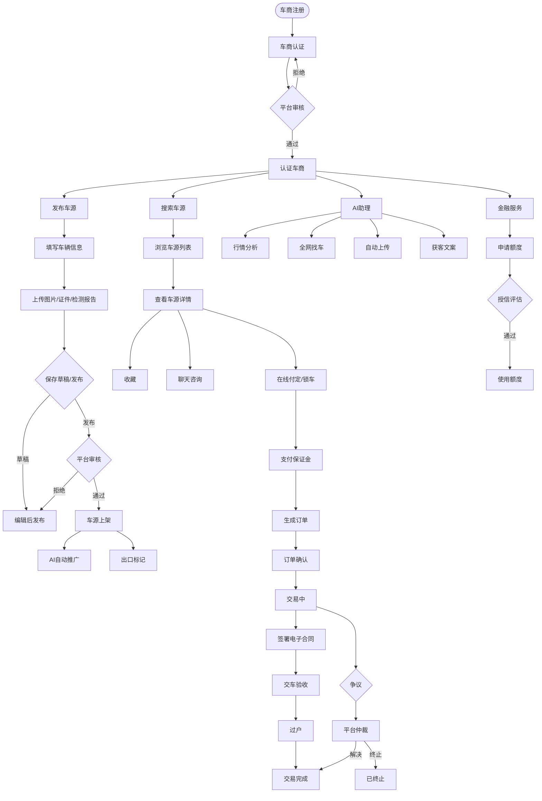
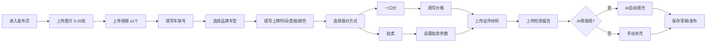
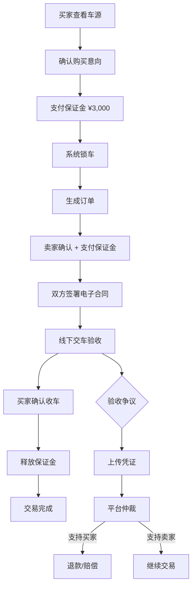

# 5D好车 - 二手车B2B交易平台

> **原型地址**: http://shengtaiprd.pancosky.com/5d/  
> **分析日期**: 2026-06-06  
> **分析方式**: Playwright 自动化抓取 + 人工产品经理分析  
> **页面总数**: 18页（含子页面）  
> **截图数**: 21张

---

## 项目介绍

**5D好车** 是一款面向二手车车商的 **B2B 移动端交易平台**，核心理念为「AI赋能二手车拓展商机」。平台采用移动优先设计（视口 390×844），主要服务对象为已认证的二手车车商，提供从车源发现、在线交易、AI智能助理到金融服务的一站式解决方案。

**核心价值主张**：
- **AI 赋能**：AI行情分析、全网找车、自动拓客、获客文案生成
- **B2B 交易撮合**：买卖双方均为认证车商，保证金机制保障交易安全
- **出口业务**：支持多国出口标签（🇷🇺 🇰🇿 🇦🇪 🇦🇺 🌍 🌏），覆盖独联体、中东、澳洲等市场
- **金融支持**：车商金融额度、低息方案、授信评估

**用户画像**（基于原型数据）：
| 属性 | 值 |
|------|-----|
| 用户昵称 | 华仔（刘德华） |
| 手机号 | 130****8888 |
| 角色 | 车商 |
| 车行 | 天津5D好车 |
| 信用等级 | S 极佳 |
| 成交次数 | 10次 |
| 可用保证金 | ¥3,000 / ¥4,200 |
| 会员到期 | 2027-06-30 |
| 在售车源 | 4台 |
| 被查看次数 | 34,010次（今日 +231） |
| 沟通次数 | 998次（今日 +45） |
| 粉丝数 | 120人（今日 +3） |

---

## 系统架构

### 技术栈推测

| 层级 | 技术 | 依据 |
|------|------|------|
| 前端框架 | React / Vue 3 | SPA 应用，`<div id="root"></div>` |
| 构建工具 | Vite | JS bundle: `/5d/assets/index-rCeiR56O.js` |
| 路由 | 前端路由（Hash/History） | 底部导航切换无页面刷新 |
| 端类型 | 移动端 H5 / 小程序 | 视口 390×844，底部 Tab 导航 |
| 后端（推测） | RESTful API | 统一的接口风格推测 |
| 文件存储（推测） | OSS / CDN | 图片/视频/证件上传 |

### 整体架构图

```
┌─────────────────────────────────────────────────┐
│                   5D好车 前端                     │
│         移动端 H5 / 小程序 (Vite + React/Vue)    │
├─────────────────────────────────────────────────┤
│  找车  │  交易  │  AI助理  │  消息  │  我的     │
├─────────────────────────────────────────────────┤
│                    API Layer                     │
├──────┬──────┬──────┬──────┬──────┬──────┬──────┤
│ 车源 │ 订单 │ 支付 │ 消息 │ 认证 │ AI  │ 金融 │
│ API  │ API  │ API  │ API  │ API  │ API │ API  │
├──────┴──────┴──────┴──────┴──────┴──────┴──────┤
│              后端服务 (推测)                      │
│  ┌────────┐ ┌────────┐ ┌────────┐ ┌─────────┐  │
│  │车源服务 │ │交易服务 │ │消息服务 │ │AI服务   │  │
│  └────────┘ └────────┘ └────────┘ └─────────┘  │
│  ┌────────┐ ┌────────┐ ┌────────┐ ┌─────────┐  │
│  │用户服务 │ │支付服务 │ │认证服务 │ │金融服务  │  │
│  └────────┘ └────────┘ └────────┘ └─────────┘  │
├─────────────────────────────────────────────────┤
│         数据层: MySQL + Redis + OSS/CDN          │
└─────────────────────────────────────────────────┘
```

---

## 菜单结构树

```
5D好车
├── 🔍 找车 (首页)
│   ├── 搜索栏 (关键词搜索)
│   ├── 语言切换 (中文)
│   ├── 地区选择 (全国/城市)
│   ├── 标签筛选
│   │   ├── 最新
│   │   ├── 新能源
│   │   ├── 保证金
│   │   └── 出口
│   ├── 车源列表 (卡片流)
│   │   └── 车源详情页
│   │       ├── 图片轮播
│   │       ├── 车辆信息
│   │       ├── 价格信息
│   │       ├── 检测报告
│   │       ├── 卖家信息
│   │       └── 操作按钮 (收藏/聊天/付定/分享)
│   ├── 悬浮按钮
│   │   ├── 发布车源
│   │   └── AI助理
│   └── 在线客服入口
│
├── 📋 交易
│   ├── 卖出的车 (Tab)
│   │   ├── 全部
│   │   ├── 待确认
│   │   ├── 交易中
│   │   ├── 争议中
│   │   ├── 已完成
│   │   └── 已终止
│   ├── 买到的车 (Tab)
│   │   └── (同上状态筛选)
│   └── 订单详情页
│       ├── 车辆信息卡片
│       ├── 价格确认表单
│       ├── 车况信息表单
│       │   ├── 整体车况 (非事故车/事故车)
│       │   ├── 漆面 (原漆/划痕剐蹭/喷漆)
│       │   ├── 结构件 (原版/受损/换件)
│       │   ├── 发动机 (正常/异常/拆卸)
│       │   ├── 变速箱 (正常/异常/拆卸)
│       │   ├── 过户次数 (一手车/一次/多次)
│       │   └── 公里数 (实表/调表/表显)
│       ├── 车况描述 (文本域)
│       ├── 车况异常照片上传
│       ├── 车辆材料上传
│       └── 订单信息 (合同编号/创建时间/保证金)
│
├── 🤖 AI助理
│   ├── 行情分析
│   ├── 全网找车
│   ├── 自动上传车源
│   ├── 获客文案生成
│   └── 语音输入
│
├── 💬 消息
│   ├── 消息 (Tab)
│   │   ├── 自动推广通知
│   │   ├── 订单状态更新
│   │   ├── 订单合同通知
│   │   ├── 保证金不足提醒
│   │   ├── 新成员申请
│   │   └── 聊天消息
│   │       ├── 张学友 - 查博士相关
│   │       └── 内部沟通
│   └── 订阅 (Tab)
│
└── 👤 我的
    ├── 个人信息区
    │   ├── 头像/昵称/手机号
    │   ├── 修改资料
    │   └── 我的主页
    ├── 数据统计
    │   ├── 车源数 (4)
    │   ├── 被查看 (34,010)
    │   ├── 沟通 (998)
    │   └── 粉丝 (120)
    ├── 认证车商功能 (已认证)
    │   └── 已认证商家标识
    ├── 快捷功能
    │   ├── 我的车源
    │   ├── AI分发车源
    │   └── AI行情简报
    └── 全部功能
        ├── 收藏车源
        ├── 我的车行
        ├── 浏览记录
        ├── 我的订单
        ├── 金融服务
        ├── 电子合同
        ├── 我的关注
        ├── 我的优惠券
        ├── 交易规范
        ├── 使用教程
        ├── 客服支持
        └── 系统设置
```

---

## 页面说明

### 1. 首页 - 找车

**截图**: `output/prototype-screenshots/01-首页-找车.png`

**页面结构**:

| 区域 | 元素 | 说明 |
|------|------|------|
| 顶部 | 语言切换 | "中文"按钮 |
| 顶部 | 地区选择 | "全国"下拉 |
| 搜索区 | 搜索框 | placeholder: "请输入搜索内容" |
| 筛选区 | 标签组 | 最新 / 新能源 / 保证金 / 出口 |
| 内容区 | 车源卡片列表 | 无限滚动加载 |
| 底部 | Tab导航 | 找车 / 交易 / AI助理 / 消息 / 我的 |
| 悬浮 | 功能按钮 | 发布车源 / AI助理 / 在线客服 |

**车源卡片结构**:

```
┌────────────────────────────────┐
│ [图片]  品牌 型号 年款          │
│         年份 里程 标签         │
│         国旗标签(出口市场)      │
│         城市 · 时间    价格(万) │
│         [拍卖状态] [剩余时间]   │
└────────────────────────────────┘
```

**车源示例数据**:

| 品牌 | 型号 | 年款 | 里程 | 价格 | 标签 | 城市 | 发布时间 |
|------|------|------|------|------|------|------|----------|
| 大众 | Polo 2023款 1.5L 自动全景乐享版 | 2023 | 0.8万km | 6.5万 | 保证金 🇷🇺🇰🇿 | 天津 | 2分钟前 |
| 斯柯达 | 晶锐 2022款 1.5L 自动车顶 | 2022 | 2.1万km | 5.2万 | 🇰🇿🌍 | 山东-青岛 | 15分钟前 |
| 奔驰 | CLE (进口) 2024款 CLE 260 2.0T | 2024 | 1.4万km | 26.8万 | 保证金 拍卖中 | 天津 | 1小时前 |
| 宝马 | X5 2023款 xDrive30Li | 2023 | 1.5万km | 34.5万 | 保证金 已参拍 拍卖中 | 北京 | 2小时前 |
| 奔驰 | EQE 2022款 350 先锋版 | 2022 | 4.7万km | 14.7万 | 纯电 | 广东-东莞 | 3小时前 |
| 奥迪 | A6L 2024款 45 TFSI 臻选动感型 | 2024 | 0.8万km | 32.6万 | 保证金 | 上海 | 4小时前 |
| 小米 | SU7 2024款 后驱长续航智驾版 | 2024 | 0.2万km | 21.5万 | 纯电 🇦🇪 拍卖中 | 北京 | 5小时前 |
| 蔚来 | ET5T 2023款 75kWh | 2023 | 1.2万km | 22.8万 | 纯电 保证金 | 上海 | 6小时前 |
| 比亚迪 | 汉EV 2024款 荣耀版 715km旗舰型 | 2024 | 0.5万km | 18.2万 | 纯电 🌏🇦🇺🌍 | 广东-广州 | 7小时前 |
| 沃尔沃 | S90 2024款 T8 E驱混动 智雅豪华版 | 2024 | 0.6万km | 36.8万 | 混动 保证金 🇦🇺 | 浙江-杭州 | 8小时前 |

**业务功能推测**：
- 平台车源聚合展示，支持多维度筛选（能源类型、保证金保障、出口市场）
- 拍卖机制：部分车源支持在线拍卖，展示剩余时间和参拍状态
- 出口标签系统：标注车源可出口的目标市场国家
- 实时更新：车源按发布时间倒序，支持"最新"排序

---

### 2. 车源详情

**截图**: `output/prototype-screenshots/02-车源详情.png`

**页面结构**:

| 区域 | 元素 | 说明 |
|------|------|------|
| 顶部 | 返回按钮 | 回到车源列表 |
| 图片区 | 图片轮播 | 车辆多角度实拍 |
| 信息区 | 品牌型号 | 大众朗逸等 |
| 信息区 | 价格 | 大字显示 |
| 信息区 | 车辆参数 | 年份/里程/城市/车源ID |
| 检测区 | 检测报告入口 | 车况检测信息 |
| 卖家区 | 卖家信息 | 车行名称/认证标识/信用等级 |
| 底部 | 操作栏 | 收藏 / 聊天 / 在线付定 / 分享 |

**操作按钮**:
- 收藏/已收藏
- 聊天咨询
- 在线付定（锁车）
- 分享/生成海报/推送微信

**业务功能推测**：
- 买家浏览车源详情后，可通过聊天与卖家直接沟通
- 在线付定功能实现"锁车"，冻结保证金确保车源不被他人购买
- 分享功能支持生成海报或推送至微信，便于车商间转介绍

---

### 3. 交易 - 卖出的车

**截图**: `output/prototype-screenshots/03-交易-卖出的车.png`

**页面结构**:

| 区域 | 元素 | 说明 |
|------|------|------|
| 顶部 | 页面标题 | "交易" |
| Tab区 | 角色切换 | 卖出的车(200) / 买到的车(90) |
| 筛选区 | 状态标签 | 全部 / 待确认 / 交易中 / 争议中 / 已完成 / 已终止 |
| 内容区 | 订单列表 | 订单卡片流 |
| 底部 | Tab导航 | 找车 / 交易 / AI助理 / 消息 / 我的 |

**订单状态流转**:

```
待确认 → 交易中 → 已完成
                 ↘ 争议中 → 已终止
                 ↘ 已终止
```

**各状态页面截图**:
- 全部: `output/prototype-screenshots/06-交易-全部订单.png`
- 待确认: `(已合并至06-交易-全部订单)`
- 交易中: `(已合并至06-交易-全部订单)`
- 争议中: `(已合并至06-交易-全部订单)`
- 已完成: `(已合并至06-交易-全部订单)`
- 已终止: `output/prototype-screenshots/07-交易-已终止.png`

**业务功能推测**：
- 卖出200台 / 买到90台的数据体现该用户为活跃车商
- 订单状态覆盖完整交易生命周期，争议状态体现平台有仲裁机制
- 状态筛选便于车商快速定位不同阶段的订单

---

### 4. 交易 - 买到的车

**截图**: `output/prototype-screenshots/05-交易-买到的车.png`

与卖出的车共享同一页面框架，通过 Tab 切换角色视角，筛选状态一致。

---

### 5. 订单详情

**截图**: `output/prototype-screenshots/08-订单详情.png`

**页面结构**:

| 区域 | 元素 | 说明 |
|------|------|------|
| 顶部 | 状态标签 | "待确认" + "保证金" |
| 车辆信息 | 车源卡片 | 奥迪 RS7 2022款 RS 7 4.0T Sportback |
| 车辆信息 | 车源ID | 87654321 |
| 车辆信息 | 交易总价 | 128.0万 |
| 车辆信息 | 定金保障金 | 3,000.00 元 |
| 详情区 | 车架号 | LHGR*********6492 |
| 详情区 | 品牌型号 | 奥迪 RS7 2022款 RS 7 4.0T Sportback |
| 详情区 | 上牌日期 | 2017-08-04 |
| 详情区 | 表显里程 | 5.3万 |
| 详情区 | 车身颜色 | 黑色 |
| 详情区 | 年检到期 | 2027-08-31 |
| 详情区 | 强险到期 | 2026-08-04 |
| 价格确认 | 交易总价 | ¥1,280,000 |
| 价格确认 | 保证金 | ¥3,000.00 |
| 车况信息 | 整体车况 | 非事故车 / 事故车 |
| 车况信息 | 漆面 | 原漆 / 划痕剐蹭 / 喷漆 |
| 车况信息 | 结构件 | 原版 / 受损 / 换件 |
| 车况信息 | 发动机 | 正常 / 异常 / 拆卸 |
| 车况信息 | 变速箱 | 正常 / 异常 / 拆卸 |
| 车况信息 | 过户次数 | 一手车 / 一次过户 / 多次过户 |
| 车况信息 | 公里数 | 实表 / 调表 / 表显 |
| 附加区 | 车况描述 | 文本域（选填） |
| 附加区 | 车况异常照片 | 支持多张上传（选填） |
| 附加区 | 车辆材料 | 行驶证/产权证/钥匙/车况图片（选填） |
| 订单信息 | 合同编号 | DJ202604181645538482 |
| 订单信息 | 创建时间 | 2026-04-18 16:45:53 |
| 订单信息 | 买方保障金 | ¥3,000.00（已支付） |
| 订单信息 | 卖方保障金 | ¥3,000.00（待支付） |
| 底部 | 操作按钮 | 打电话 |

**业务功能推测**：
- 订单详情页承载完整的交易信息，包含车辆信息、价格确认、车况评估、材料上传
- 双方保证金机制（买方已支付/卖方待支付）保障交易安全
- 合同编号（DJ开头）表明有电子合同系统
- 车况信息的多维度评估字段（7大维度）体现平台对车辆质量的严格把控
- 照片和材料上传功能用于交易凭证留存

---

### 6. AI助理

**截图**: `output/prototype-screenshots/09-AI助理.png`（注：SPA路由切换存在技术问题，此截图可能不完整）

**页面结构**（基于数据分析）:

| 区域 | 元素 | 说明 |
|------|------|------|
| 顶部 | 页面标题 | "AI助理" |
| 功能区 | 行情分析 | 车辆市场行情查询 |
| 功能区 | 全网找车 | AI代为搜索全网车源 |
| 功能区 | 自动上传 | AI自动上传车源信息 |
| 功能区 | 获客文案 | AI生成营销文案 |
| 输入区 | 文本输入 | 支持文字和语音输入 |

**业务功能推测**：
- AI行情分析：根据品牌/车型/年款查询市场均价、价格走势
- 全网找车：买家描述需求，AI在多平台搜索匹配车源
- 自动上传：AI识别车辆图片和证件信息，自动填充发布表单
- 获客文案：根据车源信息生成朋友圈/微信群营销文案
- 语音输入：降低操作门槛，车商可边看车边语音录入

---

### 7. 消息

**截图**: `output/prototype-screenshots/10-消息.png`

**页面结构**:

| 区域 | 元素 | 说明 |
|------|------|------|
| 顶部 | Tab切换 | 消息 / 订阅 |
| 消息列表 | 系统消息 | 按时间倒序排列 |

**消息类型**:

| 消息类型 | 图标 | 内容 | 时间 |
|----------|------|------|------|
| 自动推广 | 🤖 | 您有 20 个车源正在自动拓客 | 13:00:00 |
| 订单状态更新 | 📋 | 您的订单状态已更新，请点击查看详情 | 12:00:00 |
| 新的订单合同 | 📝 | 您有一份新的订单合同待签署或确认 | 11:00:00 |
| 可用保证金不足 | ⚠️ | 您的保证金不足3000，建议及时充值 | 11:00:00 |
| 新成员申请 | 👤 | 有新的员工申请加入，请点此审核 | 11:00:00 |
| 聊天消息 | 💬 | 张学友: 查博士过了吗? | 10:00:00 |
| 聊天消息 | 💬 | 华仔: 老板，奔驰那台客户约了下午看车 | 4-15 |

**业务功能推测**：
- 消息中心聚合了平台通知、业务提醒和即时通讯
- 自动推广通知表明车源有AI自动拓客功能在后台运行
- 保证金不足提醒体现平台有保证金自动监控机制
- 聊天功能支持车商间的即时沟通，"查博士"可能指车辆历史查询服务

---

### 8. 我的

**截图**: `output/prototype-screenshots/11-我的.png`

**页面结构**:

| 区域 | 元素 | 说明 |
|------|------|------|
| 顶部 | 用户信息 | 头像/昵称/手机号/修改资料/主页 |
| 标识区 | 身份认证 | 角色: 车商 / 车行: 天津5D好车 / 信用: S极佳 / 成交: 10次 |
| 保证金 | 余额显示 | 可用保证金 3,000 / 4,200 + 立即续费 |
| 统计区 | 数据卡片 | 车源(4) / 被查看(34,010) / 沟通(998) / 粉丝(120) |
| 快捷区 | 已认证功能 | 我的车源 / AI分发车源 / AI行情简报 |
| 功能区 | 全部功能 | 12个功能入口网格布局 |

**功能菜单详细**:

| 功能 | 说明 | 推测子页面 |
|------|------|------------|
| 我的车源 | 管理已发布车源(4台) | 车源列表/编辑/下架 |
| AI分发车源 | AI自动推广车源 | 推广设置/推广效果统计 |
| AI行情简报 | AI市场行情分析报告 | 行情数据/价格趋势/市场热度 |
| 收藏车源 | 已收藏的车源 | 收藏列表/取消收藏 |
| 我的车行 | 车行信息管理 | 成员管理/车行资料 |
| 浏览记录 | 浏览过的车源 | 浏览历史 |
| 我的订单 | 全部订单 | 跳转到交易页 |
| 金融服务 | 金融额度/低息方案 | 额度申请/授信状态 |
| 电子合同 | 签署的合同 | 合同列表/合同详情 |
| 我的关注 | 关注的车商/车源 | 关注列表 |
| 我的优惠券 | 优惠券 | 券列表/使用规则 |
| 交易规范 | 平台交易规则 | 规范文档 |
| 使用教程 | 新手引导 | 教程列表 |
| 客服支持 | 客服/争议处理 | 在线客服/工单 |
| 系统设置 | 账号设置 | 通知设置/隐私/退出 |

**业务功能推测**：
- 我的页面是用户中心，聚合个人数据、快捷功能和全部功能入口
- 数据统计（被查看34,010次、沟通998次）帮助车商了解曝光效果
- "立即续费"按钮说明平台采用会员制（到期日2027-06-30）
- AI分发和AI行情简报是平台差异化功能

---

## 业务流程图

### 核心交易流程



### 车源发布流程



### 保证金交易流程



---

## 页面关系图

```mermaid
graph TD
    subgraph 底部导航
        HOME[🔍 找车]
        TRADE[📋 交易]
        AI[🤖 AI助理]
        MSG[💬 消息]
        MY[👤 我的]
    end

    HOME -->|点击车源| DETAIL[车源详情]
    HOME -->|搜索/筛选| SEARCH_RESULT[搜索结果]
    HOME -->|发布车源| PUBLISH[发布车源]
    HOME -->|AI助理| AI

    DETAIL -->|付定锁车| ORDER_CREATE[创建订单]
    DETAIL -->|收藏| FAV[收藏列表]
    DETAIL -->|聊天| CHAT[聊天窗口]

    TRADE -->|卖出的车| SELL_LIST[卖出订单列表]
    TRADE -->|买到的车| BUY_LIST[买入订单列表]
    SELL_LIST -->|查看详情| ORDER_DETAIL[订单详情]
    BUY_LIST -->|查看详情| ORDER_DETAIL

    ORDER_DETAIL -->|签署合同| CONTRACT[电子合同]
    ORDER_DETAIL -->|争议| DISPUTE[争议处理]
    ORDER_DETAIL -->|打电话| PHONE[拨打电话]

    AI -->|行情分析| AI_MARKET[行情查询]
    AI -->|全网找车| AI_SEARCH[AI找车]
    AI -->|自动上传| AI_UPLOAD[AI上传]
    AI -->|获客文案| AI_COPY[文案生成]

    MSG -->|系统通知| NOTICE[通知详情]
    MSG -->|聊天消息| CHAT
    MSG -->|订阅| SUBSCRIBE[订阅管理]

    MY -->|我的车源| MY_CARS[车源管理]
    MY -->|AI分发| AI_DISTRIBUTE[AI分发设置]
    MY -->|AI行情简报| AI_REPORT[行情报告]
    MY -->|收藏车源| FAV
    MY -->|我的车行| SHOP[车行管理]
    MY -->|浏览记录| BROWSE[浏览历史]
    MY -->|我的订单| TRADE
    MY -->|金融服务| FINANCE[金融服务]
    MY -->|电子合同| CONTRACT
    MY -->|我的关注| FOLLOW[关注列表]
    MY -->|我的优惠券| COUPON[优惠券]
    MY -->|交易规范| RULES[交易规范]
    MY -->|使用教程| TUTORIAL[使用教程]
    MY -->|客服支持| CS[客服]
    MY -->|系统设置| SETTINGS[系统设置]

    FINANCE -->|申请额度| FINANCE_APPLY[额度申请]
    SHOP -->|成员管理| MEMBER[成员管理]
```



---

## 数据对象分析

### 1. 车源 (Car)

| 字段 | 类型 | 说明 |
|------|------|------|
| id | string | 车源ID（如 87654321） |
| brand | string | 品牌（大众、奔驰、宝马等） |
| model | string | 车型（Polo、CLE、X5等） |
| year | string | 年款（2023款） |
| spec | string | 具体配置（1.5L 自动全景乐享版） |
| yearOfReg | string | 上牌年份 |
| mileage | number | 表显里程（万公里） |
| price | number | 展示价格（万元） |
| city | string | 所在城市 |
| energyType | string | 能源类型（燃油/纯电/混动） |
| tags | string[] | 标签（保证金/出口/拍卖中/已参拍） |
| exportMarkets | string[] | 出口市场（🇷🇺🇰🇿🇦🇪🇦🇺🌍🌏） |
| images | string[] | 车辆图片URL |
| video | string | 视频URL（可选） |
| vin | string | 车架号（如 LHGR*********6492） |
| color | string | 车身颜色 |
| regDate | date | 上牌日期 |
| insExpireDate | date | 强险到期 |
| inspectionExpireDate | date | 年检到期 |
| factoryDate | date | 出厂年月 |
| keysCount | number | 钥匙数量 |
| usage | string | 使用性质（非营运/营运） |
| ownerType | string | 所有人性质（个人/公司/机关） |
| isMortgaged | boolean | 是否抵押车 |
| hasInheritance | boolean | 是否有继承 |
| guidePrice | number | 指导价 |
| description | string | 车源描述 |
| status | enum | 状态（草稿/待审核/在售/已售/已下架） |
| publishTime | datetime | 发布时间 |
| viewCount | number | 被查看次数 |
| auctionInfo | object | 拍卖信息（剩余时间、起拍价等） |

### 2. 订单 (Order)

| 字段 | 类型 | 说明 |
|------|------|------|
| id | string | 订单ID |
| contractNo | string | 合同编号（如 DJ202604181645538482） |
| carId | string | 关联车源ID |
| totalPrice | number | 交易总价（元） |
| buyerDeposit | number | 买方保证金 |
| sellerDeposit | number | 卖方保证金 |
| buyerDepositStatus | enum | 保证金状态（已支付/待支付） |
| sellerDepositStatus | enum | 保证金状态 |
| status | enum | 订单状态（待确认/交易中/争议中/已完成/已终止） |
| createTime | datetime | 创建时间 |
| role | enum | 当前用户角色（买家/卖家） |

### 3. 车况信息 (VehicleCondition)

| 字段 | 类型 | 选项 |
|------|------|------|
| overallCondition | enum | 非事故车 / 事故车 |
| paint | enum | 原漆 / 划痕剐蹭 / 喷漆 |
| structure | enum | 原版 / 受损 / 换件 |
| engine | enum | 正常 / 异常 / 拆卸 |
| transmission | enum | 正常 / 异常 / 拆卸 |
| transferCount | enum | 一手车 / 一次过户 / 多次过户 |
| mileageStatus | enum | 实表 / 调表 / 表显 |
| conditionDesc | string | 车况描述及其他特别约定 |
| conditionPhotos | string[] | 车况异常部位图片 |
| materials | string[] | 车辆材料（行驶证/产权证/钥匙/车况图片） |

### 4. 用户 (User)

| 字段 | 类型 | 说明 |
|------|------|------|
| id | string | 用户ID |
| nickname | string | 昵称（华仔） |
| realName | string | 真实姓名（刘德华） |
| phone | string | 手机号 |
| avatar | string | 头像URL |
| role | enum | 角色（车商/个人） |
| shopName | string | 车行名称（天津5D好车） |
| creditLevel | string | 信用等级（S极佳） |
| dealCount | number | 成交次数 |
| deposit | number | 可用保证金 |
| totalDeposit | number | 总保证金额度 |
| memberExpireDate | date | 会员到期日 |
| carCount | number | 在售车源数 |
| viewCount | number | 被查看总次数 |
| commCount | number | 沟通次数 |
| followerCount | number | 粉丝数 |
| isCertified | boolean | 是否已认证 |

### 5. 消息 (Message)

| 字段 | 类型 | 说明 |
|------|------|------|
| id | string | 消息ID |
| type | enum | 类型（系统通知/订单更新/合同/保证金/成员申请/聊天） |
| title | string | 标题 |
| content | string | 内容摘要 |
| time | datetime | 时间 |
| isRead | boolean | 是否已读 |
| senderId | string | 发送者ID（聊天消息） |
| senderName | string | 发送者名称 |

### 6. 金融服务 (Finance)

| 字段 | 类型 | 说明 |
|------|------|------|
| applicationId | string | 申请编号 |
| shopName | string | 车行名称 |
| amount | number | 申请额度 |
| status | enum | 状态（评估中/通过/拒绝） |
| assessTime | datetime | 评估时间 |
| specialist | string | 金融专员 |

---

## API 推测

### 车源相关

| 方法 | 路径 | 说明 | 参数 |
|------|------|------|------|
| GET | `/api/cars` | 车源列表 | keyword, city, brand, energyType, tag, page, pageSize, sort |
| GET | `/api/cars/{id}` | 车源详情 | id |
| POST | `/api/cars` | 发布车源 | 车源完整信息 |
| PUT | `/api/cars/{id}` | 编辑/保存草稿 | 车源字段 |
| DELETE | `/api/cars/{id}` | 下架/删除车源 | id |
| POST | `/api/cars/{id}/favorite` | 收藏车源 | id |
| DELETE | `/api/cars/{id}/favorite` | 取消收藏 | id |
| POST | `/api/cars/{id}/lock` | 支付定金锁车 | id, depositAmount |
| GET | `/api/cars/{id}/inspection` | 获取检测报告 | id |

### 交易相关

| 方法 | 路径 | 说明 | 参数 |
|------|------|------|------|
| GET | `/api/orders` | 订单列表 | role, status, page, pageSize |
| GET | `/api/orders/{id}` | 订单详情 | id |
| POST | `/api/orders/{id}/confirm` | 确认订单 | id |
| POST | `/api/orders/{id}/condition` | 提交车况信息 | 车况各字段 |
| POST | `/api/orders/{id}/materials` | 上传车辆材料 | 文件列表 |
| POST | `/api/orders/{id}/contract` | 签署/确认合同 | id |
| POST | `/api/orders/{id}/disputes` | 发起争议 | id, 争议描述, 凭证 |
| POST | `/api/orders/{id}/complete` | 确认完成 | id |

### 用户相关

| 方法 | 路径 | 说明 | 参数 |
|------|------|------|------|
| POST | `/api/auth/login` | 登录 | phone, code/password |
| POST | `/api/auth/register` | 注册 | phone, code |
| GET | `/api/user/profile` | 个人信息 | - |
| PUT | `/api/user/profile` | 修改资料 | nickname, avatar 等 |
| GET | `/api/user/stats` | 数据统计 | - |
| POST | `/api/merchant/certifications` | 提交车商认证 | 企业信息, 营业执照 |
| GET | `/api/merchant/profile` | 车行资料 | - |
| GET | `/api/merchant/members` | 车行成员 | - |

### 消息相关

| 方法 | 路径 | 说明 | 参数 |
|------|------|------|------|
| GET | `/api/messages` | 消息列表 | type, page, pageSize |
| POST | `/api/messages/{id}/read` | 标记已读 | id |
| GET | `/api/messages/subscriptions` | 订阅列表 | - |
| GET | `/api/chats` | 聊天列表 | - |
| GET | `/api/chats/{id}/messages` | 聊天消息 | id, page |
| POST | `/api/chats/{id}/messages` | 发送消息 | id, content |

### AI 相关

| 方法 | 路径 | 说明 | 参数 |
|------|------|------|------|
| POST | `/api/ai/market-analysis` | 行情分析 | brand, model, year |
| POST | `/api/ai/find-cars` | 全网找车 | 需求描述 |
| POST | `/api/ai/auto-upload` | 自动上传 | 图片/证件文件 |
| POST | `/api/ai/copywriting` | 获客文案 | carId, 平台类型 |
| POST | `/api/ai/distribute` | AI分发车源 | carId, channels |

### 金融相关

| 方法 | 路径 | 说明 | 参数 |
|------|------|------|------|
| POST | `/api/finance/applications` | 申请金融额度 | 车行资料 |
| GET | `/api/finance/credit-line` | 额度中心 | - |
| GET | `/api/finance/plans` | 金融方案列表 | - |

### 其他

| 方法 | 路径 | 说明 | 参数 |
|------|------|------|------|
| GET | `/api/coupons` | 优惠券列表 | - |
| POST | `/api/coupons/{id}/use` | 使用优惠券 | id |
| GET | `/api/contracts` | 电子合同列表 | - |
| GET | `/api/contracts/{id}` | 合同详情 | id |
| POST | `/api/customer-service/tickets` | 创建客服工单 | 问题描述, 凭证 |
| GET | `/api/tutorials` | 使用教程列表 | - |
| GET | `/api/trading-rules` | 交易规范 | - |

---

## 附录：截图索引

| 编号 | 截图文件名 | 说明 |
|------|-----------|------|
| 01 | `01-首页-找车.png` | 首页 - 车源列表、搜索、筛选 |
| 02 | `02-车源详情.png` | 车源详情 - 大众朗逸 |
| 03 | `03-交易-卖出的车.png` | 交易页 - 卖出的车(200) |
| 04 | `04-交易-卖出的车-筛选.png` | 交易页 - 卖出的车状态筛选 |
| 05 | `05-交易-买到的车.png` | 交易页 - 买到的车(90) |
| 06 | `06-交易-全部订单.png` | 交易页 - 全部订单列表 |
| 07 | `07-交易-已终止.png` | 交易页 - 已终止订单 |
| 08 | `08-订单详情.png` | 订单详情 - 奥迪RS7 |
| 09 | `09-AI助理.png` | AI助理页面 |
| 10 | `10-消息.png` | 消息列表（消息/订阅） |
| 11 | `11-我的.png` | 我的页面（最新） |
| 12 | `12-我的-旧.png` | 我的页面（旧版） |
