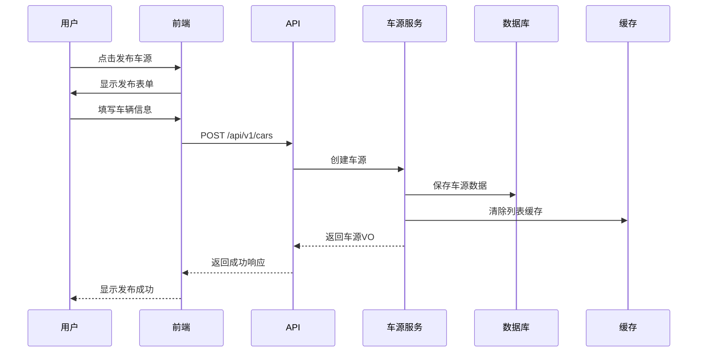
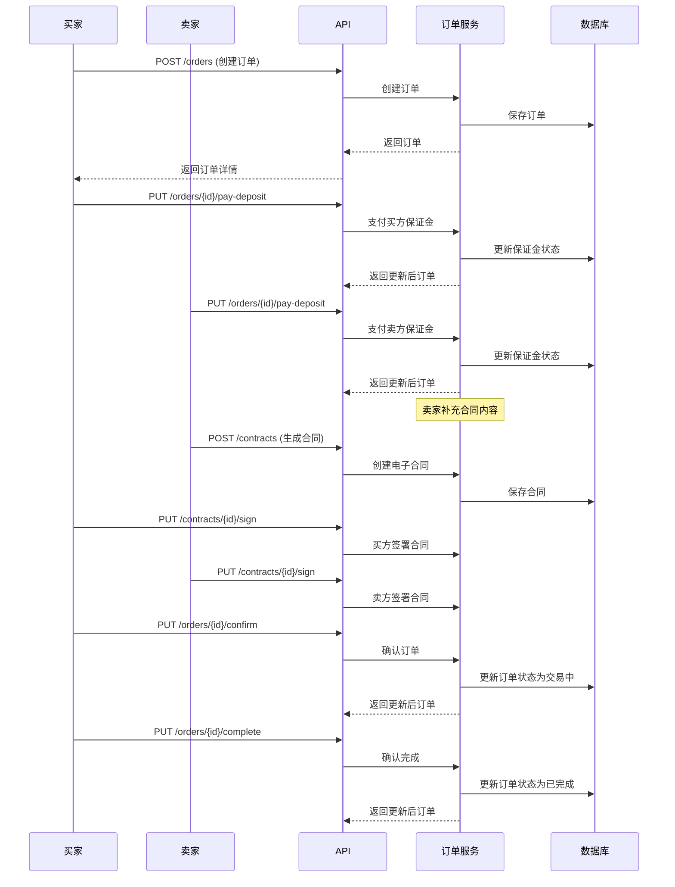

# 5D好车 - 企业级开发文档

> **项目名称**: 5D好车 B2B 二手车交易平台  
> **版本**: v1.0.0  
> **编写日期**: 2026-06-08  
> **后端核心**: Spring Boot 3.5.14 (Java 21) + MyBatis-Plus 3.5.6 + PostgreSQL 16 + Redis 7 + RocketMQ 5.x + JWT 0.12.5  
> **前端核心**: uni-app 3.0.0-alpha-5010220260604001 + Vue 3.4.21 + Vuex 4.1.0 + uView Plus 3.8.49 + Vite 5.0 + Sass 1.77.0（支持微信小程序 / H5 / App）

---

## 文档目录

1. [功能模块](./docs/01-功能模块.md) — 13个模块，100+功能点
2. [页面清单](./docs/02-页面清单.md) — 16个页面 UI 元素清单
3. [API设计](./docs/03-API设计.md) — 15个 API 模块接口定义
4. [数据库设计](./docs/04-数据库设计.md) — 28张表完整 DDL
5. [Java实体类](./docs/05-Java实体类.md) — 28个实体 + 14个枚举
6. [SpringBoot接口](./docs/06-SpringBoot接口.md) — WebSocket + RocketMQ 消息推送设计
7. [日志与缓存](./docs/07-日志与缓存.md) — 日志规范与缓存设计
8. [开发规范](./docs/08-开发规范.md) — 前后端编码规范

---

## 🔧 完整技术栈

### 后端技术 (car-trade-backend)

| 分类 | 技术组件 | 版本 | 在项目中的作用 |
|------|----------|------|----------------|
| **核心框架** | Spring Boot | 3.5.14 | 应用基础框架，提供自动配置与 Starters 体系 |
| **JDK** | Java | 21 | 项目源码级别，`--release 21` 编译，使用虚拟线程与新 API |
| **Web 层** | Spring Boot Starter Web | 3.5.14 | RESTful API / 控制器层 / 内置 Tomcat 容器 |
| **ORM** | MyBatis-Plus Spring Boot3 Starter | 3.5.6 | 数据访问层，32 个实体 + 28+ 个 Mapper，提供分页、Lambda 查询、自动填充 |
| **数据库** | PostgreSQL JDBC Driver | (由 Spring Boot BOM 管理) | 主业务数据库驱动，28 张表 |
| **缓存** | Spring Boot Starter Data Redis | 3.5.14 | 车源列表缓存、热点数据、分布式会话/Token 黑名单 |
| **参数校验** | Spring Boot Starter Validation | 3.5.14 | DTO/请求参数的 `@Valid` 校验 |
| **AOP** | Spring Boot Starter AOP | 3.5.14 | `OperationLogAspect` 操作日志切面、权限切面 |
| **实时通信** | Spring Boot Starter WebSocket | 3.5.14 | 聊天/客服消息实时推送，STOMP 协议 |
| **消息队列** | RocketMQ Spring Boot Starter | 2.3.2 | `MessageProducer` / `MessageConsumer`，事件驱动、消息解耦（拍卖结算、订单状态变更） |
| **认证** | JJWT (io.jsonwebtoken) | 0.12.5 | `JwtUtil` 签发/校验 Token，`AuthenticationInterceptor` 拦截校验 |
| **代码生成** | Lombok | 1.18.36 | `@Data` / `@NoArgsConstructor` / `@AllArgsConstructor` 简化实体与 VO |
| **工具库** | Hutool All | 5.8.26 | 日期、字符串、集合、加密、HTTP 等通用工具方法 |
| **日志** | 阿里云 SLS Logback Appender | 0.1.19 | 生产环境日志投递到阿里云 SLS（Simple Log Service） |
| **序列化** | Protobuf Java | 3.25.3 | 日志/消息的二进制序列化（SLS Appender 依赖） |
| **测试** | Spring Boot Starter Test | 3.5.14 | 单元测试/集成测试（JUnit + Mockito + Spring Test） |
| **构建** | Maven Compiler Plugin | 3.11.0 | Java 21 源码编译；`spring-boot-maven-plugin` 打包可执行 JAR |

### 前端技术 (car-trade-frontend)

| 分类 | 技术组件 | 版本 | 在项目中的作用 |
|------|----------|------|----------------|
| **跨端框架** | uni-app (uni-app) | 3.0.0-alpha-5010220260604001 | 一套代码编译到 H5 / 微信小程序 / App |
| **核心视图层** | Vue | 3.4.21 | 响应式 UI 组件化开发（Composition API） |
| **状态管理** | Vuex | 4.1.0 | 全局状态（登录用户、购物车/订单状态） |
| **UI 组件库** | uView Plus | ^3.8.49 | Vue 3 时代的 uni-app UI 组件库（表单、列表、弹窗等） |
| **UI 组件库** | uView UI | ^2.0.36 | 兼容低版本组件（部分页面使用） |
| **构建工具** | Vite | ^5.0.0 | 开发服务器与 H5 构建（`npm run dev:h5` / `build:h5`） |
| **CSS 预处理器** | Sass | ^1.77.0 | `uni.scss` 全局样式变量与嵌套 CSS |
| **DCloud 插件** | @dcloudio/vite-plugin-uni | 3.0.0-alpha-5010220260604001 | Vite 下 uni-app 编译插件 |

### 数据库与缓存

| 组件 | 版本/类型 | 在项目中的作用 |
|------|-----------|----------------|
| **PostgreSQL** | 16 | 主数据库：users、car_sources、orders、contracts、auctions、chat_messages、coupons 等 28 张表 |
| **Redis** | 7.x | 1) 车源列表缓存与 TTL；2) Token/短信验证码存储；3) 热点数据（如品牌/车系列表） |

### 消息与实时通信

| 组件 | 版本/协议 | 在项目中的作用 |
|------|-----------|----------------|
| **Apache RocketMQ** | 5.x (Client 2.3.2) | `MessageProducer` 发布事件（订单创建、拍卖结算、消息通知）；`MessageConsumer` 异步消费并触发业务逻辑 |
| **WebSocket (STOMP)** | Spring WebSocket | 买家/卖家实时聊天、推送订单状态变更、拍卖出价广播；`WebSocketConfig` + `WebSocketAuthInterceptor` 实现认证握手 |

### 安全与认证

| 组件 | 版本 | 在项目中的作用 |
|------|------|----------------|
| **JWT (JJWT)** | 0.12.5 | 登录后签发 Token（含用户 ID、手机号、过期时间）；`JwtUtil` 解析与刷新；`AuthenticationInterceptor` 对 Level 2 / Level 3 接口鉴权 |
| **三级权限** | - | 1) 公开接口；2) 需登录接口；3) 商家认证接口（详见下方"权限控制"章节） |

### 运维与监控

| 组件 | 版本 | 在项目中的作用 |
|------|------|----------------|
| **阿里云 SLS** | - | 集中式日志收集（Logback Appender 0.1.19 + Protobuf 3.25.3） |
| **AOP 操作日志** | - | `@OperationLog` 注解 + `OperationLogAspect`，自动记录关键业务操作 |

### 代码结构与模式

| 模式/模块 | 文件数量 | 说明 |
|-----------|---------|------|
| **Entity 实体** | 32 | 每张表对应一个 `@TableName` 实体（User、CarSource、Order、Contract、Auction、ChatMessage、Coupon 等） |
| **Mapper 接口** | 28+ | 继承 `BaseMapper<T>`，提供基础 CRUD + 自定义查询 |
| **Service 接口 + Impl** | 32+ | `IService<T>` / `ServiceImpl<M, T>` 模式，业务逻辑实现层 |
| **Controller 控制器** | 14 | UserController、CarController、OrderController、AuctionController、ChatController、CouponController、ContractController、MessageController、FinanceController、MembershipController、ShopMemberController、CustomerServiceController、FollowController、AIController |
| **DTO / VO** | 40+ | 请求参数 DTO（LoginDTO、CarCreateDTO、OrderCreateDTO 等）+ 响应 VO（UserVO、CarVO、OrderVO、AuctionVO、ChatMessageVO 等） |
| **枚举 Enum** | 14 | OrderStatus、AuctionStatus、CouponType、MemberLevel、CreditGrade、DepositType、MessageType、CsTicketStatus、ContractStatus、ShopMemberRole、ShopMemberStatus、ChatConversationType、EnergyType、CertificationStatus |
| **配置 Config** | 6+ | MyBatisPlusConfig、WebSocketConfig、RedisConfig、JacksonConfig、WebMvcConfig |
| **拦截器 Interceptor** | 2 | AuthenticationInterceptor（HTTP Token 鉴权）、WebSocketAuthInterceptor（WS 握手鉴权） |
| **异常处理** | 2 | GlobalExceptionHandler（全局统一返回格式）、BusinessException（业务异常） |
| **消息管理 Manager** | 3 | MessageProducer、MessageConsumer（RocketMQ）、PushManager（推送） |
| **定时任务 Task** | 1 | AuctionSettlementTask（拍卖到期结算） |
| **缓存服务 Cache** | 1 | CarCacheService（车源列表/详情缓存） |
| **工具 Util** | 3 | JwtUtil（Token 签发/校验）、SecurityUtils（安全辅助）、AiClient（AI 外部接口调用） |
| **切面 Aspect** | 1 | OperationLogAspect（AOP 操作日志） |
| **注解 Annotation** | 1 | @OperationLog（标注需要记录的方法） |

### 构建与部署工具

| 工具 | 推荐版本 | 说明 |
|------|---------|------|
| **Maven** | 3.9.6+ | 后端构建与依赖管理；`mvn clean install`（Spring Boot 3.5.x 推荐 3.9+，支持 Java 21） |
| **Node.js** | 18+ | 前端依赖与构建；`npm install && npm run build:h5` |
| **npm** | 9.x+ | 前端包管理 |

---

## 项目结构

```
new-car-trade/
├── car-trade-backend/           # 后端项目 (Maven, 160+ Java 文件)
├── car-trade-frontend/          # 前端项目 (uni-app, 60+ 文件)
├── docs/                        # 设计文档 (8 份)
└── output/                      # 原型分析输出
```

---

## 快速开始

### 1. 环境准备

- JDK 21+ (推荐 Eclipse Temurin 21 LTS)
- PostgreSQL 16
- Redis 7
- Maven 3.9.6+
- Node.js 18+

### 2. 数据库初始化

```sql
CREATE DATABASE new_car_trade WITH ENCODING 'UTF-8' LC_COLLATE 'zh_CN.utf8';
```

### 3. 配置修改

修改 `car-trade-backend/src/main/resources/application.yml` 中的数据库、Redis 配置。

### 4. 启动后端

```bash
cd car-trade-backend
mvn clean install
java -jar target/new-car-trade-1.0.0-SNAPSHOT.jar
```

### 5. 启动前端

```bash
cd car-trade-frontend
npm install
npm run dev:h5          # H5 开发模式
# 或
npm run dev:mp-weixin   # 微信小程序
```

---

## 系统架构

```
┌─────────────────────────────────────────────────┐
│              5D好车 前端 (uni-app + uView)        │
│         移动端 H5 / 微信小程序 / App             │
├─────────────────────────────────────────────────┤
│  找车  │  交易  │  AI助理  │  消息  │  我的     │
├─────────────────────────────────────────────────┤
│                    API Layer                     │
├──────┬──────┬──────┬──────┬──────┬──────┬──────┤
│ 车源 │ 订单 │ 支付 │ 消息 │ 认证 │ AI  │ 金融 │
│ API  │ API  │ API  │ API  │ API  │ API │ API  │
│ 关注 │ 车行 │ 客服 │ 合同 │ 会员 │ 聊天│ 优惠券│
│ API  │ API  │ API  │ API  │ API  │ API │ API  │
├──────┴──────┴──────┴──────┴──────┴──────┴──────┤
│            后端服务 (Spring Boot 3.5.14)          │
│  ┌────────┐ ┌────────┐ ┌────────┐ ┌─────────┐  │
│  │车源服务 │ │交易服务 │ │消息服务 │ │AI服务   │  │
│  └────────┘ └────────┘ └────────┘ └─────────┘  │
│  ┌────────┐ ┌────────┐ ┌────────┐ ┌─────────┐  │
│  │用户服务 │ │支付服务 │ │认证服务 │ │金融服务  │  │
│  └────────┘ └────────┘ └────────┘ └─────────┘  │
│  ┌────────┐ ┌────────┐ ┌────────┐ ┌─────────┐  │
│  │车行服务 │ │合同服务 │ │客服服务 │ │会员服务  │  │
│  └────────┘ └────────┘ └────────┘ └─────────┘  │
├─────────────────────────────────────────────────┤
│      数据层: PostgreSQL 16 + Redis 7 + OSS       │
│      消息队列: RocketMQ 5.x                      │
│      实时推送: WebSocket (STOMP)                 │
└─────────────────────────────────────────────────┘
```

---

## 核心业务流程

### 车源发布流程



### 订单交易流程



## 权限控制

### 前端权限体系

项目采用**三级权限控制**体系，基于接口权限 + 页面级权限双重防护：

```
┌─────────────────────────────────────────────────────────────┐
│                    权限控制入口                               │
└─────────────────────────────────────────────────────────────┘
│
├── 🔓 Level 1: 公开接口 (无需登录)
│   ├── 登录/注册接口
│   ├── 车源列表查询 (GET /cars)
│   ├── 车源详情查询 (GET /cars/{id})
│   ├── 可用优惠券列表
│   ├── AI 智能搜索 & 市场分析 (公开试用)
│   ├── 关注状态查询
│   └── 图片下载
│
├── 🔐 Level 2: 需登录接口 (必须登录)
│   ├── 用户信息/统计
│   ├── 订单管理（创建/支付/查询）
│   ├── 消息/聊天
│   ├── 合同签署
│   ├── 我的车源/优惠券/会员
│   ├── 浏览记录
│   └── 金融服务
│
└── 🏢 Level 3: 商家认证接口 (需登录 + 认证商家)
    ├── 发布车源 (POST /cars)
    ├── 车行成员管理
    ├── AI 分发车源
    ├── AI 自动触达
    └── AI 文案生成
```

#### 文件结构

| 文件 | 作用 |
|------|------|
| `car-trade-frontend/src/api/permissions.js` | 权限配置中心 - 公开接口白名单 + 商家认证接口清单 + 权限级别判定函数 |
| `car-trade-frontend/src/api/request.js` | HTTP 拦截器 - 请求拦截器区分公开/需登录接口；响应拦截器处理 401（跳登录页）/403（无权限提示） |
| `car-trade-frontend/src/utils/auth.js` | 认证与权限工具 - `isAuthed()` / `requireAuth()` / `getAuthLevel()` |

#### 请求拦截逻辑

```
请求发起 → 检查是否为公开接口 → 是 → 正常发送
               ↓（非公开）
          检查是否已登录 → 是 → 注入 token → 正常发送
               ↓（未登录）
          拦截并提示"请先登录后再操作"
          300ms 后跳转到登录页
```

#### 响应拦截逻辑

```
收到响应 → 状态码判定
   ├── 200 → 正常返回数据
   ├── 401 未认证 → 区分：
   │   ├── 公开接口 401 → 仅提示"服务暂不可用"（后端配置问题）
   │   └── 需登录接口 401 → 清除本地 token + 跳登录页
   ├── 403 无权限 → 提示"无权限进行此操作，请先完成商家认证"
   └── 其他错误 → 统一提示"请求失败，请重试"
```

---

## 联系方式

如有问题，请联系开发团队。
