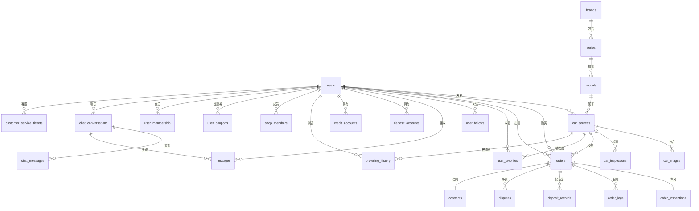

## 四、PostgreSQL 数据库设计

### 4.1 数据库规范

- **数据库名**: new_car_trade
- **字符集**: UTF-8
- **排序规则**: zh_CN.utf8

### 4.2 ER 图



### 4.3 表结构设计

#### 4.3.1 用户表 users

```sql
CREATE TABLE users (
    id              BIGSERIAL PRIMARY KEY,
    phone           VARCHAR(20) NOT NULL UNIQUE,
    nickname        VARCHAR(50),
    real_name       VARCHAR(50),
    avatar_url      VARCHAR(500),
    shop_name       VARCHAR(100),
    credit_grade    VARCHAR(10) DEFAULT 'C',
    credit_score    INTEGER DEFAULT 60,
    deal_count      INTEGER DEFAULT 0,
    on_sale_count   INTEGER DEFAULT 0,
    view_count      BIGINT DEFAULT 0,
    view_count_today INTEGER DEFAULT 0,
    message_count   BIGINT DEFAULT 0,
    message_count_today INTEGER DEFAULT 0,
    follower_count  INTEGER DEFAULT 0,
    follower_count_today INTEGER DEFAULT 0,
    member_expire_at TIMESTAMP,
    certification_status VARCHAR(20) DEFAULT 'UNCERTIFIED',
    status          VARCHAR(20) DEFAULT 'ACTIVE',
    created_at      TIMESTAMP DEFAULT CURRENT_TIMESTAMP,
    updated_at      TIMESTAMP DEFAULT CURRENT_TIMESTAMP,
    deleted_at      TIMESTAMP
);

CREATE INDEX idx_users_phone ON users(phone);
CREATE INDEX idx_users_status ON users(status);
COMMENT ON TABLE users IS '用户表';
COMMENT ON COLUMN users.credit_grade IS '信用等级: S-极佳, A-优秀, B-良好, C-一般, D-较差';
COMMENT ON COLUMN users.certification_status IS '认证状态: UNCERTIFIED-未认证, PENDING-审核中, CERTIFIED-已认证, REJECTED-已拒绝';
```

#### 4.3.2 车源表 car_sources

```sql
CREATE TABLE car_sources (
    id              BIGSERIAL PRIMARY KEY,
    user_id         BIGINT NOT NULL REFERENCES users(id),
    brand_id        INTEGER NOT NULL,
    series_id       INTEGER NOT NULL,
    model_id        INTEGER NOT NULL,
    title           VARCHAR(200),
    year            INTEGER,
    mileage         INTEGER,
    price           DECIMAL(12,2),
    deposit         DECIMAL(10,2),
    color           VARCHAR(20),
    city_code       VARCHAR(20),
    city_name       VARCHAR(50),
    energy_type     VARCHAR(20),
    usage_type      VARCHAR(20),
    owner_type      VARCHAR(20),
    is_mortgaged    BOOLEAN DEFAULT FALSE,
    is_inherited    BOOLEAN DEFAULT FALSE,
    registration_date DATE,
    insurance_expiry DATE,
    inspection_expiry DATE,
    production_date VARCHAR(10),
    key_count       INTEGER,
    description     TEXT,
    auction_status  VARCHAR(20),
    auction_end_time TIMESTAMP,
    view_count      BIGINT DEFAULT 0,
    favorite_count  INTEGER DEFAULT 0,
    status          VARCHAR(20) DEFAULT 'ACTIVE',
    published_at    TIMESTAMP,
    created_at      TIMESTAMP DEFAULT CURRENT_TIMESTAMP,
    updated_at      TIMESTAMP DEFAULT CURRENT_TIMESTAMP,
    deleted_at      TIMESTAMP
);

CREATE INDEX idx_car_sources_user_id ON car_sources(user_id);
CREATE INDEX idx_car_sources_brand_series ON car_sources(brand_id, series_id);
CREATE INDEX idx_car_sources_city ON car_sources(city_code);
CREATE INDEX idx_car_sources_price ON car_sources(price);
CREATE INDEX idx_car_sources_status ON car_sources(status);
CREATE INDEX idx_car_sources_created_at ON car_sources(created_at DESC);
COMMENT ON TABLE car_sources IS '车源表';
COMMENT ON COLUMN car_sources.energy_type IS '能源类型: GASOLINE-燃油, PURE_ELECTRIC-纯电, HYBRID-混动';
COMMENT ON COLUMN car_sources.auction_status IS '拍卖状态: NONE-未拍卖, BIDDING-拍卖中, BIDDED-已参拍';
```

#### 4.3.3 车源图片表 car_images

```sql
CREATE TABLE car_images (
    id              BIGSERIAL PRIMARY KEY,
    car_id          BIGINT NOT NULL REFERENCES car_sources(id),
    image_url       VARCHAR(500) NOT NULL,
    image_type      VARCHAR(20),
    sort_order      INTEGER DEFAULT 0,
    created_at      TIMESTAMP DEFAULT CURRENT_TIMESTAMP
);

CREATE INDEX idx_car_images_car_id ON car_images(car_id);
COMMENT ON TABLE car_images IS '车源图片表';
COMMENT ON COLUMN car_images.image_type IS '图片类型: EXTERIOR-外观, INTERIOR-内饰, DETAIL-细节, DEFECT-瑕疵';
```

#### 4.3.4 车源标签表 car_tags

```sql
CREATE TABLE car_tags (
    id              BIGSERIAL PRIMARY KEY,
    car_id          BIGINT NOT NULL REFERENCES car_sources(id),
    tag_type        VARCHAR(20) NOT NULL,
    tag_value       VARCHAR(50),
    created_at      TIMESTAMP DEFAULT CURRENT_TIMESTAMP
);

CREATE INDEX idx_car_tags_car_id ON car_tags(car_id);
CREATE INDEX idx_car_tags_type ON car_tags(tag_type);
COMMENT ON TABLE car_tags IS '车源标签表';
COMMENT ON COLUMN car_tags.tag_type IS '标签类型: DEPOSIT-保证金, EXPORT-出口, ENERGY-能源';
```

#### 4.3.5 检测报告表 car_inspections

```sql
CREATE TABLE car_inspections (
    id              BIGSERIAL PRIMARY KEY,
    car_id          BIGINT NOT NULL REFERENCES car_sources(id),
    overall_condition VARCHAR(20),
    paint           VARCHAR(20),
    structure       VARCHAR(20),
    engine          VARCHAR(20),
    transmission    VARCHAR(20),
    transfer_count  INTEGER,
    mileage_type    VARCHAR(20),
    description     TEXT,
    abnormal_photos JSONB,
    created_at      TIMESTAMP DEFAULT CURRENT_TIMESTAMP,
    updated_at      TIMESTAMP DEFAULT CURRENT_TIMESTAMP
);

CREATE INDEX idx_car_inspections_car_id ON car_inspections(car_id);
COMMENT ON TABLE car_inspections IS '车辆检测报告表';
COMMENT ON COLUMN car_inspections.overall_condition IS '整体车况: NORMAL-非事故车, ACCIDENT-事故车';
COMMENT ON COLUMN car_inspections.paint IS '漆面: ORIGINAL-原漆, SCRATCH-划痕剐蹭, PAINTED-喷漆';
COMMENT ON COLUMN car_inspections.mileage_type IS '公里数类型: ACTUAL-实表, TAMPERED-调表, DISPLAY-表显';
```

#### 4.3.6 订单表 orders

```sql
CREATE TABLE orders (
    id              VARCHAR(32) PRIMARY KEY,
    car_id          BIGINT NOT NULL REFERENCES car_sources(id),
    buyer_id        BIGINT NOT NULL REFERENCES users(id),
    seller_id       BIGINT NOT NULL REFERENCES users(id),
    total_price     DECIMAL(12,2) NOT NULL,
    deposit_amount  DECIMAL(10,2),
    buyer_deposit_paid BOOLEAN DEFAULT FALSE,
    buyer_deposit_paid_at TIMESTAMP,
    seller_deposit_paid BOOLEAN DEFAULT FALSE,
    seller_deposit_paid_at TIMESTAMP,
    status          VARCHAR(20) DEFAULT 'PENDING_CONFIRM',
    contract_no     VARCHAR(32),
    remark          TEXT,
    cancel_reason   VARCHAR(200),
    completed_at    TIMESTAMP,
    cancelled_at    TIMESTAMP,
    created_at      TIMESTAMP DEFAULT CURRENT_TIMESTAMP,
    updated_at      TIMESTAMP DEFAULT CURRENT_TIMESTAMP
);

CREATE INDEX idx_orders_car_id ON orders(car_id);
CREATE INDEX idx_orders_buyer_id ON orders(buyer_id);
CREATE INDEX idx_orders_seller_id ON orders(seller_id);
CREATE INDEX idx_orders_status ON orders(status);
CREATE INDEX idx_orders_created_at ON orders(created_at DESC);
COMMENT ON TABLE orders IS '订单表';
COMMENT ON COLUMN orders.status IS '订单状态: PENDING_CONFIRM-待确认, TRADING-交易中, DISPUTE-争议中, COMPLETED-已完成, CANCELLED-已终止';
```

#### 4.3.7 订单车况表 order_inspections

```sql
CREATE TABLE order_inspections (
    id              BIGSERIAL PRIMARY KEY,
    order_id        VARCHAR(32) NOT NULL REFERENCES orders(id),
    overall_condition VARCHAR(20),
    paint           VARCHAR(20),
    structure       VARCHAR(20),
    engine          VARCHAR(20),
    transmission    VARCHAR(20),
    transfer_count  INTEGER,
    mileage_type    VARCHAR(20),
    description     TEXT,
    abnormal_photos JSONB,
    materials       JSONB,
    created_at      TIMESTAMP DEFAULT CURRENT_TIMESTAMP,
    updated_at      TIMESTAMP DEFAULT CURRENT_TIMESTAMP
);

CREATE INDEX idx_order_inspections_order_id ON order_inspections(order_id);
COMMENT ON TABLE order_inspections IS '订单车况信息表';
```

#### 4.3.8 订单日志表 order_logs

```sql
CREATE TABLE order_logs (
    id              BIGSERIAL PRIMARY KEY,
    order_id        VARCHAR(32) NOT NULL REFERENCES orders(id),
    action          VARCHAR(50) NOT NULL,
    operator_id     BIGINT,
    operator_name   VARCHAR(50),
    remark          TEXT,
    created_at      TIMESTAMP DEFAULT CURRENT_TIMESTAMP
);

CREATE INDEX idx_order_logs_order_id ON order_logs(order_id);
COMMENT ON TABLE order_logs IS '订单日志表';
```

#### 4.3.9 保证金账户表 deposit_accounts

```sql
CREATE TABLE deposit_accounts (
    id              BIGSERIAL PRIMARY KEY,
    user_id         BIGINT NOT NULL UNIQUE REFERENCES users(id),
    balance         DECIMAL(10,2) DEFAULT 0,
    frozen_amount   DECIMAL(10,2) DEFAULT 0,
    total_deposit   DECIMAL(10,2) DEFAULT 0,
    status          VARCHAR(20) DEFAULT 'ACTIVE',
    created_at      TIMESTAMP DEFAULT CURRENT_TIMESTAMP,
    updated_at      TIMESTAMP DEFAULT CURRENT_TIMESTAMP
);

CREATE INDEX idx_deposit_accounts_user_id ON deposit_accounts(user_id);
COMMENT ON TABLE deposit_accounts IS '保证金账户表';
```

#### 4.3.10 保证金流水表 deposit_records

```sql
CREATE TABLE deposit_records (
    id              BIGSERIAL PRIMARY KEY,
    account_id      BIGINT NOT NULL REFERENCES deposit_accounts(id),
    order_id        VARCHAR(32),
    type            VARCHAR(20) NOT NULL,
    amount          DECIMAL(10,2) NOT NULL,
    balance_after   DECIMAL(10,2),
    remark          VARCHAR(200),
    created_at      TIMESTAMP DEFAULT CURRENT_TIMESTAMP
);

CREATE INDEX idx_deposit_records_account_id ON deposit_records(account_id);
CREATE INDEX idx_deposit_records_created_at ON deposit_records(created_at DESC);
COMMENT ON TABLE deposit_records IS '保证金流水表';
COMMENT ON COLUMN deposit_records.type IS '类型: RECHARGE-充值, WITHDRAW-提现, PAY-支付, REFUND-退款, FREEZE-冻结, UNFREEZE-解冻';
```

#### 4.3.11 信用账户表 credit_accounts

```sql
CREATE TABLE credit_accounts (
    id              BIGSERIAL PRIMARY KEY,
    user_id         BIGINT NOT NULL UNIQUE REFERENCES users(id),
    credit_limit    DECIMAL(12,2) DEFAULT 0,
    used_amount     DECIMAL(12,2) DEFAULT 0,
    available_amount DECIMAL(12,2) DEFAULT 0,
    status          VARCHAR(20) DEFAULT 'ACTIVE',
    created_at      TIMESTAMP DEFAULT CURRENT_TIMESTAMP,
    updated_at      TIMESTAMP DEFAULT CURRENT_TIMESTAMP
);

CREATE INDEX idx_credit_accounts_user_id ON credit_accounts(user_id);
COMMENT ON TABLE credit_accounts IS '信用账户表';
```

#### 4.3.12 消息表 messages

```sql
CREATE TABLE messages (
    id              BIGSERIAL PRIMARY KEY,
    user_id         BIGINT NOT NULL REFERENCES users(id),
    type            VARCHAR(20) NOT NULL,
    title           VARCHAR(200),
    content         TEXT,
    is_read         BOOLEAN DEFAULT FALSE,
    related_id      VARCHAR(50),
    related_type    VARCHAR(20),
    created_at      TIMESTAMP DEFAULT CURRENT_TIMESTAMP
);

CREATE INDEX idx_messages_user_id ON messages(user_id);
CREATE INDEX idx_messages_type ON messages(type);
CREATE INDEX idx_messages_is_read ON messages(is_read);
CREATE INDEX idx_messages_created_at ON messages(created_at DESC);
COMMENT ON TABLE messages IS '消息表';
COMMENT ON COLUMN messages.type IS '消息类型: SYSTEM-系统消息, TRADE-交易通知, ACTIVITY-活动通知, AUTO_PROMOTION-自动推广, CHAT-聊天消息, TEAM_APPLICATION-车行成员申请, DEPOSIT_WARNING-保证金不足';
```

#### 4.3.13 收藏表 user_favorites

```sql
CREATE TABLE user_favorites (
    id              BIGSERIAL PRIMARY KEY,
    user_id         BIGINT NOT NULL REFERENCES users(id),
    car_id          BIGINT NOT NULL REFERENCES car_sources(id),
    created_at      TIMESTAMP DEFAULT CURRENT_TIMESTAMP,
    UNIQUE(user_id, car_id)
);

CREATE INDEX idx_user_favorites_user_id ON user_favorites(user_id);
CREATE INDEX idx_user_favorites_car_id ON user_favorites(car_id);
COMMENT ON TABLE user_favorites IS '用户收藏表';
```

#### 4.3.14 品牌表 brands

```sql
CREATE TABLE brands (
    id              SERIAL PRIMARY KEY,
    name            VARCHAR(50) NOT NULL,
    logo_url        VARCHAR(500),
    first_letter    VARCHAR(1),
    sort_order      INTEGER DEFAULT 0,
    status          VARCHAR(20) DEFAULT 'ACTIVE',
    created_at      TIMESTAMP DEFAULT CURRENT_TIMESTAMP
);

CREATE INDEX idx_brands_first_letter ON brands(first_letter);
COMMENT ON TABLE brands IS '汽车品牌表';
```

#### 4.3.15 车系表 series

```sql
CREATE TABLE series (
    id              SERIAL PRIMARY KEY,
    brand_id        INTEGER NOT NULL REFERENCES brands(id),
    name            VARCHAR(50) NOT NULL,
    sort_order      INTEGER DEFAULT 0,
    status          VARCHAR(20) DEFAULT 'ACTIVE',
    created_at      TIMESTAMP DEFAULT CURRENT_TIMESTAMP
);

CREATE INDEX idx_series_brand_id ON series(brand_id);
COMMENT ON TABLE series IS '车系表';
```

#### 4.3.16 车型表 models

```sql
CREATE TABLE models (
    id              SERIAL PRIMARY KEY,
    series_id       INTEGER NOT NULL REFERENCES series(id),
    name            VARCHAR(100) NOT NULL,
    year            INTEGER,
    guide_price     DECIMAL(12,2),
    sort_order      INTEGER DEFAULT 0,
    status          VARCHAR(20) DEFAULT 'ACTIVE',
    created_at      TIMESTAMP DEFAULT CURRENT_TIMESTAMP
);

CREATE INDEX idx_models_series_id ON models(series_id);
COMMENT ON TABLE models IS '车型表';
```

#### 4.3.17 争议表 disputes

```sql
CREATE TABLE disputes (
    id              BIGSERIAL PRIMARY KEY,
    order_id        VARCHAR(32) NOT NULL REFERENCES orders(id),
    initiator_id    BIGINT NOT NULL REFERENCES users(id),
    reason          VARCHAR(500),
    description     TEXT,
    evidence        JSONB,
    status          VARCHAR(20) DEFAULT 'PENDING',
    result          VARCHAR(20),
    handler_id      BIGINT,
    handled_at      TIMESTAMP,
    created_at      TIMESTAMP DEFAULT CURRENT_TIMESTAMP,
    updated_at      TIMESTAMP DEFAULT CURRENT_TIMESTAMP
);

CREATE INDEX idx_disputes_order_id ON disputes(order_id);
CREATE INDEX idx_disputes_status ON disputes(status);
COMMENT ON TABLE disputes IS '争议表';
COMMENT ON COLUMN disputes.status IS '状态: PENDING-待处理, PROCESSING-处理中, RESOLVED-已解决, REJECTED-已驳回';

#### 4.3.18 车行成员表 shop_members

```sql
CREATE TABLE shop_members (
    id              BIGSERIAL PRIMARY KEY,
    shop_user_id    BIGINT NOT NULL REFERENCES users(id),
    member_user_id  BIGINT NOT NULL REFERENCES users(id),
    role            VARCHAR(20) DEFAULT 'MEMBER',
    status          VARCHAR(20) DEFAULT 'PENDING',
    applied_at      TIMESTAMP DEFAULT CURRENT_TIMESTAMP,
    approved_at     TIMESTAMP,
    created_at      TIMESTAMP DEFAULT CURRENT_TIMESTAMP,
    updated_at      TIMESTAMP DEFAULT CURRENT_TIMESTAMP,
    UNIQUE(shop_user_id, member_user_id)
);

CREATE INDEX idx_shop_members_shop ON shop_members(shop_user_id);
CREATE INDEX idx_shop_members_member ON shop_members(member_user_id);
COMMENT ON TABLE shop_members IS '车行成员表';
COMMENT ON COLUMN shop_members.role IS '角色: OWNER-车行主, ADMIN-管理员, MEMBER-成员';
COMMENT ON COLUMN shop_members.status IS '状态: PENDING-待审批, ACTIVE-已加入, REJECTED-已拒绝';
```

#### 4.3.19 用户关注表 user_follows

```sql
CREATE TABLE user_follows (
    id              BIGSERIAL PRIMARY KEY,
    user_id         BIGINT NOT NULL REFERENCES users(id),
    follow_user_id  BIGINT NOT NULL REFERENCES users(id),
    created_at      TIMESTAMP DEFAULT CURRENT_TIMESTAMP,
    UNIQUE(user_id, follow_user_id)
);

CREATE INDEX idx_user_follows_user ON user_follows(user_id);
CREATE INDEX idx_user_follows_follow ON user_follows(follow_user_id);
COMMENT ON TABLE user_follows IS '用户关注表（关注卖家）';
```

#### 4.3.20 浏览记录表 browsing_history

```sql
CREATE TABLE browsing_history (
    id              BIGSERIAL PRIMARY KEY,
    user_id         BIGINT NOT NULL REFERENCES users(id),
    car_id          BIGINT NOT NULL REFERENCES car_sources(id),
    created_at      TIMESTAMP DEFAULT CURRENT_TIMESTAMP
);

CREATE INDEX idx_browsing_history_user ON browsing_history(user_id, created_at DESC);
COMMENT ON TABLE browsing_history IS '浏览记录表';
```

#### 4.3.21 优惠券表 coupons

```sql
CREATE TABLE coupons (
    id              BIGSERIAL PRIMARY KEY,
    name            VARCHAR(100) NOT NULL,
    type            VARCHAR(20) NOT NULL,
    value           DECIMAL(10,2) NOT NULL,
    min_amount      DECIMAL(10,2) DEFAULT 0,
    total_count     INTEGER DEFAULT 0,
    remain_count    INTEGER DEFAULT 0,
    start_at        TIMESTAMP,
    end_at          TIMESTAMP,
    status          VARCHAR(20) DEFAULT 'ACTIVE',
    created_at      TIMESTAMP DEFAULT CURRENT_TIMESTAMP
);

CREATE INDEX idx_coupons_status ON coupons(status);
COMMENT ON TABLE coupons IS '优惠券定义表';
COMMENT ON COLUMN coupons.type IS '券类型: CASH-现金券, DISCOUNT-折扣券, FREE_SHIPPING-免运费';
```

#### 4.3.22 用户优惠券表 user_coupons

```sql
CREATE TABLE user_coupons (
    id              BIGSERIAL PRIMARY KEY,
    user_id         BIGINT NOT NULL REFERENCES users(id),
    coupon_id       BIGINT NOT NULL REFERENCES coupons(id),
    used_at         TIMESTAMP,
    order_id        VARCHAR(32),
    status          VARCHAR(20) DEFAULT 'UNUSED',
    created_at      TIMESTAMP DEFAULT CURRENT_TIMESTAMP
);

CREATE INDEX idx_user_coupons_user ON user_coupons(user_id);
COMMENT ON TABLE user_coupons IS '用户优惠券表';
COMMENT ON COLUMN user_coupons.status IS '状态: UNUSED-未使用, USED-已使用, EXPIRED-已过期';
```

#### 4.3.23 会员方案表 member_plans

```sql
CREATE TABLE member_plans (
    id              BIGSERIAL PRIMARY KEY,
    name            VARCHAR(50) NOT NULL,
    level           VARCHAR(20) NOT NULL,
    price           DECIMAL(10,2) NOT NULL,
    duration_days   INTEGER NOT NULL,
    benefits        JSONB,
    sort_order      INTEGER DEFAULT 0,
    status          VARCHAR(20) DEFAULT 'ACTIVE',
    created_at      TIMESTAMP DEFAULT CURRENT_TIMESTAMP
);

COMMENT ON TABLE member_plans IS '会员方案表';
COMMENT ON COLUMN member_plans.level IS '等级: BRONZE-青铜, SILVER-白银, GOLD-黄金, DIAMOND-钻石';
COMMENT ON COLUMN member_plans.benefits IS '权益JSON: {"free_publish": 50, "discount_rate": 0.9, "ai_analysis": true}';
```

#### 4.3.24 用户会员表 user_membership

```sql
CREATE TABLE user_membership (
    id              BIGSERIAL PRIMARY KEY,
    user_id         BIGINT NOT NULL REFERENCES users(id),
    plan_id         BIGINT NOT NULL REFERENCES member_plans(id),
    level           VARCHAR(20) NOT NULL,
    start_at        TIMESTAMP NOT NULL,
    expire_at       TIMESTAMP NOT NULL,
    status          VARCHAR(20) DEFAULT 'ACTIVE',
    created_at      TIMESTAMP DEFAULT CURRENT_TIMESTAMP,
    updated_at      TIMESTAMP DEFAULT CURRENT_TIMESTAMP
);

CREATE INDEX idx_user_membership_user ON user_membership(user_id);
COMMENT ON TABLE user_membership IS '用户会员表';
COMMENT ON COLUMN user_membership.status IS '状态: ACTIVE-有效, EXPIRED-已过期, CANCELLED-已取消';
```

#### 4.3.25 在线客服工单表 customer_service_tickets

```sql
CREATE TABLE customer_service_tickets (
    id              BIGSERIAL PRIMARY KEY,
    user_id         BIGINT NOT NULL REFERENCES users(id),
    title           VARCHAR(200),
    category        VARCHAR(50),
    status          VARCHAR(20) DEFAULT 'PENDING',
    priority        VARCHAR(20) DEFAULT 'NORMAL',
    handler_id      BIGINT,
    handled_at      TIMESTAMP,
    created_at      TIMESTAMP DEFAULT CURRENT_TIMESTAMP,
    updated_at      TIMESTAMP DEFAULT CURRENT_TIMESTAMP
);

CREATE INDEX idx_cs_tickets_user ON customer_service_tickets(user_id);
CREATE INDEX idx_cs_tickets_status ON customer_service_tickets(status);
COMMENT ON TABLE customer_service_tickets IS '在线客服工单表';
COMMENT ON COLUMN customer_service_tickets.status IS '状态: PENDING-待处理, PROCESSING-处理中, RESOLVED-已解决, CLOSED-已关闭';
COMMENT ON COLUMN customer_service_tickets.priority IS '优先级: LOW-低, NORMAL-普通, HIGH-高, URGENT-紧急';
```

#### 4.3.26 聊天会话表 chat_conversations

```sql
CREATE TABLE chat_conversations (
    id              BIGSERIAL PRIMARY KEY,
    type            VARCHAR(20) DEFAULT 'SINGLE',
    related_order_id VARCHAR(32),
    last_message    TEXT,
    last_message_at TIMESTAMP,
    created_at      TIMESTAMP DEFAULT CURRENT_TIMESTAMP,
    updated_at      TIMESTAMP DEFAULT CURRENT_TIMESTAMP
);

COMMENT ON TABLE chat_conversations IS '聊天会话表';
COMMENT ON COLUMN chat_conversations.type IS '会话类型: SINGLE-单聊, ORDER-订单咨询, CS-客服';
```

#### 4.3.27 聊天会话成员表 chat_conversation_members

```sql
CREATE TABLE chat_conversation_members (
    id              BIGSERIAL PRIMARY KEY,
    conversation_id BIGINT NOT NULL REFERENCES chat_conversations(id),
    user_id         BIGINT NOT NULL REFERENCES users(id),
    unread_count    INTEGER DEFAULT 0,
    last_read_at    TIMESTAMP,
    created_at      TIMESTAMP DEFAULT CURRENT_TIMESTAMP,
    UNIQUE(conversation_id, user_id)
);

CREATE INDEX idx_ccm_user ON chat_conversation_members(user_id);
COMMENT ON TABLE chat_conversation_members IS '聊天会话成员表';
```

#### 4.3.28 电子合同表 contracts

```sql
CREATE TABLE contracts (
    id              BIGSERIAL PRIMARY KEY,
    order_id        VARCHAR(32) NOT NULL REFERENCES orders(id),
    contract_no     VARCHAR(32) NOT NULL UNIQUE,
    template_id     VARCHAR(50),
    title           VARCHAR(200),
    content         TEXT,
    buyer_id        BIGINT NOT NULL REFERENCES users(id),
    seller_id       BIGINT NOT NULL REFERENCES users(id),
    buyer_signed    BOOLEAN DEFAULT FALSE,
    buyer_signed_at TIMESTAMP,
    seller_signed   BOOLEAN DEFAULT FALSE,
    seller_signed_at TIMESTAMP,
    status          VARCHAR(20) DEFAULT 'DRAFT',
    file_url        VARCHAR(500),
    created_at      TIMESTAMP DEFAULT CURRENT_TIMESTAMP,
    updated_at      TIMESTAMP DEFAULT CURRENT_TIMESTAMP
);

CREATE INDEX idx_contracts_order ON contracts(order_id);
CREATE INDEX idx_contracts_no ON contracts(contract_no);
COMMENT ON TABLE contracts IS '电子合同表';
COMMENT ON COLUMN contracts.status IS '状态: DRAFT-草稿, PENDING_SIGN-待签署, SIGNED-已签署, ARCHIVED-已归档';
```
