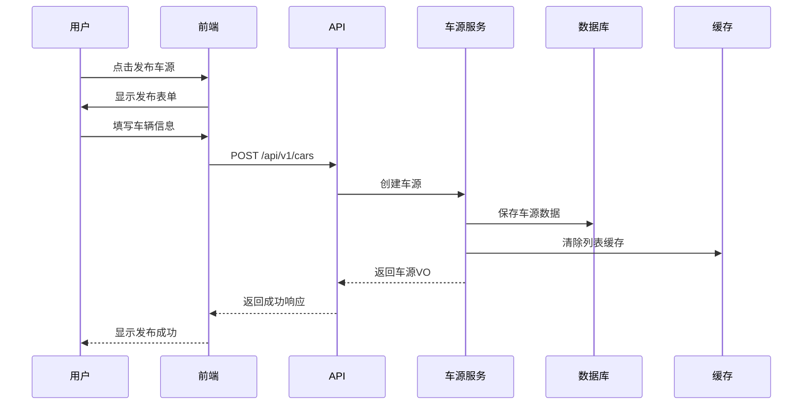
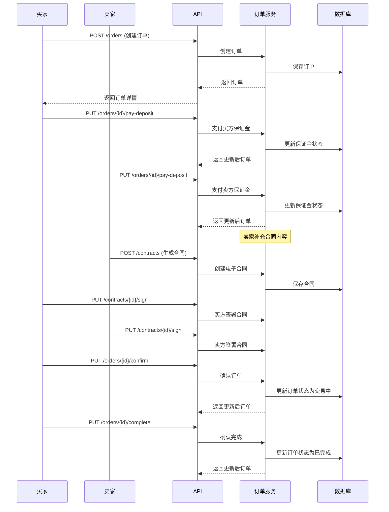

# 5D好车 - 企业级开发文档

> **项目名称**: 5D好车 B2B 二手车交易平台  
> **版本**: v1.0.0  
> **编写日期**: 2026-06-06  
> **技术栈**: Spring Boot 3.5.14 + MyBatis-Plus 3.5.6 + PostgreSQL 16 + Redis 7  

---

## 文档目录

1. [功能模块](./docs/01-功能模块.md)
2. [页面清单](./docs/02-页面清单.md)
3. [API设计](./docs/03-API设计.md)
4. [数据库设计](./docs/04-数据库设计.md)
5. [Java实体类](./docs/05-Java实体类.md)
6. [SpringBoot接口](./docs/06-SpringBoot接口.md)
7. [日志与缓存](./docs/07-日志与缓存.md)
8. [开发规范](./docs/08-开发规范.md)

---

## 快速开始

### 1. 环境准备

- JDK 21+ (推荐 Eclipse Temurin 21 LTS)
- PostgreSQL 16
- Redis 7
- Maven 3.8+

### 2. 数据库初始化

```sql
CREATE DATABASE new_car_trade WITH ENCODING 'UTF-8' LC_COLLATE 'zh_CN.utf8';
```

### 3. 配置修改

修改 `application.yml` 中的数据库、Redis、SLS 配置。

### 4. 启动应用

```bash
mvn clean install
java -jar target/new-car-trade-1.0.0-SNAPSHOT.jar
```

---

## 系统架构

```
┌─────────────────────────────────────────────────┐
│                   5D好车 前端                     │
│         移动端 H5 / 小程序 (Vite + React/Vue)    │
├─────────────────────────────────────────────────┤
│  找车  │  交易  │  AI助理  │  消息  │  我的     │
├─────────────────────────────────────────────────┤
│                    API Layer                     │
├──────┬──────┬──────┬──────┬──────┬──────┬──────┤
│ 车源 │ 订单 │ 支付 │ 消息 │ 认证 │ AI  │ 金融 │
│ API  │ API  │ API  │ API  │ API  │ API │ API  │
│ 关注 │ 车行 │ 客服 │ 合同 │ 会员 │ 聊天│ 优惠券│
│ API  │ API  │ API  │ API  │ API  │ API │ API  │
├──────┴──────┴──────┴──────┴──────┴──────┴──────┤
│              后端服务 (SpringBoot 3.x)            │
│  ┌────────┐ ┌────────┐ ┌────────┐ ┌─────────┐  │
│  │车源服务 │ │交易服务 │ │消息服务 │ │AI服务   │  │
│  └────────┘ └────────┘ └────────┘ └─────────┘  │
│  ┌────────┐ ┌────────┐ ┌────────┐ ┌─────────┐  │
│  │用户服务 │ │支付服务 │ │认证服务 │ │金融服务  │  │
│  └────────┘ └────────┘ └────────┘ └─────────┘  │
│  ┌────────┐ ┌────────┐ ┌────────┐ ┌─────────┐  │
│  │车行服务 │ │合同服务 │ │客服服务 │ │会员服务  │  │
│  └────────┘ └────────┘ └────────┘ └─────────┘  │
├─────────────────────────────────────────────────┤
│         数据层: PostgreSQL + Redis + OSS/CDN      │
└─────────────────────────────────────────────────┘
```

---

## 核心业务流程

### 车源发布流程



### 订单交易流程



---

## 联系方式

如有问题，请联系开发团队。
